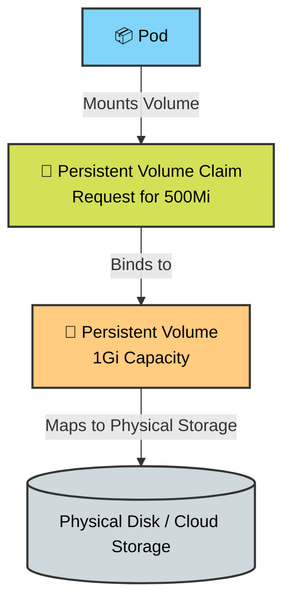

# 🚀 Day 55: Persistent Volumes (PV) & Persistent Volume Claims (PVC) 💾


Welcome to Day 55 of the **Production-Ready DevOps & SRE Journey**. 

Containers are ephemeral by design. When a Pod dies, is rescheduled, or crashes, the local file system is wiped clean. While this is great for stateless applications (like web servers), it is a catastrophic problem for stateful applications like databases (MySQL, PostgreSQL) or monitoring stacks (Prometheus) that need data to survive restarts. 

Today, we solve the data persistence problem using Kubernetes **Persistent Volumes (PV)** and **Persistent Volume Claims (PVC)**.

---

## 🧠 Core Theory: Kubernetes Storage Architecture

### Why Containers Need Persistent Storage
If a database pod restarts and loses all its data, you have an outage. Persistent storage decouples the data lifecycle from the Pod lifecycle, ensuring data survives even if the container is entirely destroyed.

### PVs vs. PVCs (The Provider vs. The Consumer)
*   **Persistent Volume (PV):** A piece of physical storage in the cluster (like an AWS EBS volume, NFS share, or local disk). It is a **cluster-wide** resource provisioned by an administrator.
*   **Persistent Volume Claim (PVC):** A request for storage by a user/developer. It is a **namespaced** resource. Think of it as a "claim ticket." Kubernetes automatically binds a PVC to a PV that matches its capacity and access requirements.

### Static vs. Dynamic Provisioning
*   **Static Provisioning:** An SRE manually creates physical disks and writes PV manifests for them. Developers then create PVCs to claim them.
*   **Dynamic Provisioning:** The modern enterprise standard. Developers only create a PVC. A `StorageClass` watches for the PVC, automatically provisions the physical disk in the cloud, and creates the PV on the fly.

### Access Modes & Reclaim Policies
*   **ReadWriteOnce (RWO):** The volume can be mounted as read-write by a single Node. (Standard for databases).
*   **ReadOnlyMany (ROX):** The volume can be mounted read-only by many Nodes.
*   **ReadWriteMany (RWX):** The volume can be mounted as read-write by many Nodes. (Requires specialized network storage like NFS or AWS EFS).
*   **Reclaim Policy - Retain:** When the PVC is deleted, the PV and data are kept for manual recovery.
*   **Reclaim Policy - Delete:** When the PVC is deleted, the underlying cloud storage and PV are automatically destroyed.

---

## 🏗️ Visualizing Storage Architecture



---

## 🛠️ Execution Runbook

### Task 1: See the Problem — Data Lost on Pod Deletion

First, let's prove that standard containers lose data. We will use an `emptyDir` volume, which shares the Pod's lifecycle.

**1. Create `ephemeral-pod.yaml`**

```yaml
apiVersion: v1
kind: Pod
metadata:
  name: ephemeral-pod
spec:
  containers:
  - name: busybox
    image: busybox:latest
    command: ["/bin/sh", "-c", "sleep 3600"]
    volumeMounts:
    - name: data-vol
      mountPath: /data
  volumes:
  - name: data-vol
    emptyDir: {}

```

**2. Apply, Write Data, and Recreate:**

```bash
kubectl apply -f ephemeral-pod.yaml
# Wait for running state, then write a timestamped message
kubectl exec ephemeral-pod -- sh -c "date > /data/message.txt; cat /data/message.txt"

# Delete and recreate the pod
kubectl delete pod ephemeral-pod
kubectl apply -f ephemeral-pod.yaml

# Check the file again
kubectl exec ephemeral-pod -- cat /data/message.txt

```

* **Verification:** You will get a `No such file or directory` error. The data is permanently gone!

---

### Task 2: Create a PersistentVolume (Static Provisioning)

Let's create a manual storage block on the Node's hard drive.

**1. Create `manual-pv.yaml**`

```yaml
apiVersion: v1
kind: PersistentVolume
metadata:
  name: manual-pv
spec:
  capacity:
    storage: 1Gi
  accessModes:
    - ReadWriteOnce
  persistentVolumeReclaimPolicy: Retain
  hostPath:
    path: "/tmp/k8s-pv-data"
    type: DirectoryOrCreate

```

**2. Apply and Verify:**

```bash
kubectl apply -f manual-pv.yaml
kubectl get pv

```

* **Verification:** The `STATUS` of the PV should clearly say `Available`.

---

### Task 3: Create a PersistentVolumeClaim

Now, we claim 500Mi of the 1Gi we just created.

**1. Create `manual-pvc.yaml**`

```yaml
apiVersion: v1
kind: PersistentVolumeClaim
metadata:
  name: manual-pvc
spec:
  accessModes:
    - ReadWriteOnce
  resources:
    requests:
      storage: 500Mi

```

**2. Apply and Verify the Bind:**

```bash
kubectl apply -f manual-pvc.yaml
kubectl get pvc
kubectl get pv

```

* **Verification:** The `STATUS` of both the PVC and PV should instantly change to `Bound`. The `VOLUME` column in the `get pvc` output will show `manual-pv`.

---

### Task 4: Use the PVC in a Pod — Data That Survives

Let's attach our bound claim ticket to a Pod.

**1. Create `pvc-pod.yaml**`

```yaml
apiVersion: v1
kind: Pod
metadata:
  name: persistent-pod
spec:
  containers:
  - name: busybox
    image: busybox:latest
    command: ["/bin/sh", "-c", "sleep 3600"]
    volumeMounts:
    - name: persistent-storage
      mountPath: /data
  volumes:
  - name: persistent-storage
    persistentVolumeClaim:
      claimName: manual-pvc

```

**2. Test Data Survival:**

```bash
kubectl apply -f pvc-pod.yaml

# Write data
kubectl exec persistent-pod -- sh -c "echo 'SRE Data Test 1' > /data/message.txt"
kubectl exec persistent-pod -- cat /data/message.txt

# Nuke the pod and recreate it!
kubectl delete pod persistent-pod
kubectl apply -f pvc-pod.yaml

# Verify data survived
kubectl exec persistent-pod -- cat /data/message.txt

```

* **Verification:** The file will still contain "SRE Data Test 1". The storage outlived the Pod!

---

### Task 5: StorageClasses and Dynamic Provisioning

Writing manual PVs does not scale in a cluster with 1,000 developers.

**1. Inspect your cluster's StorageClass:**

```bash
kubectl get storageclass
kubectl describe storageclass

```

* **Verification:** You will see a `standard` or `default` StorageClass. Note its `Provisioner` (e.g., `k8s.io/minikube-hostpath` or `ebs.csi.aws.com`) and its default Reclaim Policy (`Delete`).

---

### Task 6: Dynamic Provisioning in Action

Let's let Kubernetes create the physical disk for us.

**1. Create `dynamic-pvc.yaml**`

```yaml
apiVersion: v1
kind: PersistentVolumeClaim
metadata:
  name: dynamic-pvc
spec:
  storageClassName: standard # Use the name from Task 5
  accessModes:
    - ReadWriteOnce
  resources:
    requests:
      storage: 2Gi

```

**2. Apply and Observe the Magic:**

```bash
kubectl apply -f dynamic-pvc.yaml
kubectl get pvc
kubectl get pv

```

* **Verification:** You will now see *two* PVs! One is `manual-pv`, and the other is a dynamically generated PV (usually with a long, random UUID name) that Kubernetes created automatically to satisfy `dynamic-pvc`.

---

### Task 7: Clean Up (The Reclaim Policy Test)

Let's observe what happens to the underlying storage when the Claims are deleted.

**1. Delete Resources in Order:**

```bash
# 1. Delete Pods first (otherwise PVCs get stuck terminating)
kubectl delete pod ephemeral-pod persistent-pod

# 2. Delete the PVCs
kubectl delete pvc manual-pvc dynamic-pvc

# 3. Check the PVs
kubectl get pv

```

**Verification & SRE Conclusion:**

* **The Dynamic PV:** Completely disappeared! Because its StorageClass defaults to the `Delete` reclaim policy, destroying the claim also destroyed the virtual hard drive.
* **The Manual PV:** Still exists, but its status changed from `Bound` to `Released`. Because we explicitly set `persistentVolumeReclaimPolicy: Retain` in Task 2, Kubernetes preserved the data on the disk, requiring an administrator to manually recover or delete it.

**Clean up the remaining manual PV:**

```bash
kubectl delete pv manual-pv

```
