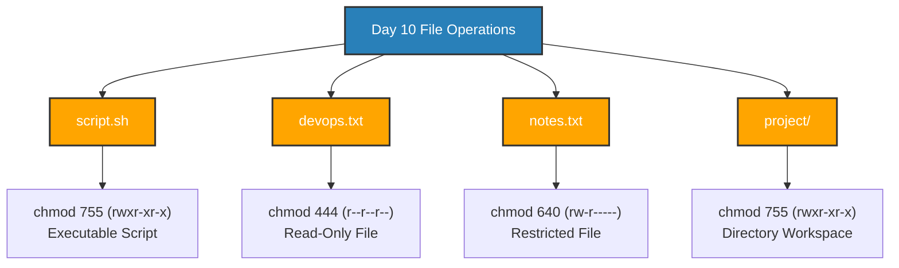
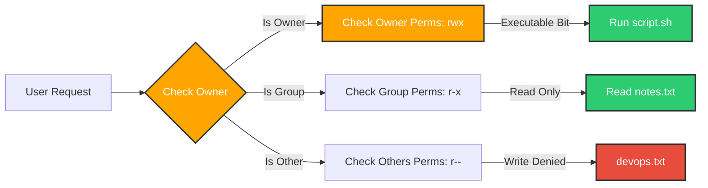

# 🐧 📄 $\color{red}\text{\textbf{Day 10 Challenge:}}$ File Permissions & File Operations

## 📌 Challenge Overview

This challenge covers the core concepts of file creation, viewing, permission structure (`rwx`), permission modification using `chmod`, and analyzing system permission boundaries and error handling in Linux.



---

## 1. Task Execution & Hands-on Steps

### Task 1: Create Files
Created the required files using `touch`, `echo`, and `vim`:

```bash
# 1. Create empty file devops.txt
touch devops.txt

# 2. Create notes.txt with content
echo "Welcome to Day 10 of the DevOps Journey!" > notes.txt

# 3. Create script.sh using vim with required script content
vim script.sh

```

**Content of `script.sh`:**

```bash
#!/bin/bash
echo "Hello DevOps"

```

**Verification (`ls -l`):**

```text
-rw-r--r-- 1 ubuntu ubuntu  0 Aug  1 10:00 devops.txt
-rw-r--r-- 1 ubuntu ubuntu 41 Aug  1 10:01 notes.txt
-rw-r--r-- 1 ubuntu ubuntu 31 Aug  1 10:02 script.sh

```


---

### Task 2: Read Files

1. **Read `notes.txt` using `cat`:**
```bash
cat notes.txt

```


*Output:* `Welcome to Day 10 of the DevOps Journey!`

2. **View `script.sh` in read-only mode:**
```bash
vim -R script.sh
# OR
view script.sh

```


3. **Display the first 5 lines of `/etc/passwd`:**
```bash
head -n 5 /etc/passwd

```


*Output:*
```text
root:x:0:0:root:/root:/bin/bash
daemon:x:1:1:daemon:/usr/sbin:/usr/sbin/nologin
bin:x:2:2:bin:/bin:/usr/sbin/nologin
sys:x:3:3:sys:/dev:/usr/sbin/nologin
sync:x:4:65534:sync:/bin:/bin/sync

```


4. **Display the last 5 lines of `/etc/passwd`:**
```bash
tail -n 5 /etc/passwd

```


*Output:*
```text
sshd:x:121:65534::/run/sshd:/usr/sbin/nologin
ubuntu:x:1000:1000:Ubuntu:/home/ubuntu:/bin/bash
lxd:x:999:100:LXD user account:/var/snap/lxd/common/lxd:/bin/false
systemd-coredump:x:998:998:systemd Core Dumper:/:/usr/sbin/nologin
devops:x:1001:1001::/home/devops:/bin/bash

```


---

### Task 3: Understand Permissions



Linux permissions are represented in a 9-character triad string: `rwxrwxrwx` (Owner - Group - Others).

* **`r` (Read):** Value = **4**
* **`w` (Write):** Value = **2**
* **`x` (Execute):** Value = **1**

#### Initial Permission Analysis:

Current status from `ls -l`: `-rw-r--r--` (`644` in octal) for all three files (`devops.txt`, `notes.txt`, `script.sh`).

* **Owner (`rw-` = 4+2+0 = 6):** Can Read and Write. Cannot Execute.
* **Group (`r--` = 4+0+0 = 4):** Can Read only. Cannot Write or Execute.
* **Others (`r--` = 4+0+0 = 4):** Can Read only. Cannot Write or Execute.

---

### Task 4: Modify Permissions

1. **Make `script.sh` executable & run it:**
```bash
chmod +x script.sh
./script.sh

```


*Output:* `Hello DevOps`

2. **Set `devops.txt` to read-only (remove write permission for all):**
```bash
chmod a-w devops.txt
ls -l devops.txt

```


*Permissions:* `-r--r--r--` (`444`)

3. **Set `notes.txt` to `640`:**
```bash
chmod 640 notes.txt
ls -l notes.txt

```


*Permissions:* `-rw-r-----` (`640` - Owner: `rw`, Group: `r`, Others: `none`)

4. **Create directory `project/` with permissions `755`:**
```bash
mkdir project
chmod 755 project
ls -ld project

```


*Permissions:* `drwxr-xr-x` (`755` - Owner: `rwx`, Group: `r-x`, Others: `r-x`)

---

### Task 5: Test Permissions & Error Messages

1. **Attempting to write to read-only file `devops.txt`:**
```bash
echo "Adding text" >> devops.txt

```


*Captured Error Message:*
```text
bash: devops.txt: Permission denied

```


2. **Attempting to execute `script.sh` after removing execute permission:**
```bash
chmod -x script.sh
./script.sh

```


*Captured Error Message:*
```text
bash: ./script.sh: Permission denied

```


---

## ## Files Created

* `devops.txt` — Empty file created using `touch`
* `notes.txt` — Notes file created using `echo`
* `script.sh` — Bash shell script created using `vim`
* `project/` — Workspace directory created using `mkdir`

---

## ## Permission Changes

| File / Directory | Initial Permissions | Command Applied | Final Permissions | Final Octal | Description |
| --- | --- | --- | --- | --- | --- |
| **`script.sh`** | `-rw-r--r--` | `chmod +x script.sh` | `-rwxr-xr-x` | `755` | Made file executable for owner, group, and others. |
| **`devops.txt`** | `-rw-r--r--` | `chmod a-w devops.txt` | `-r--r--r--` | `444` | Removed write permission; file made strictly read-only. |
| **`notes.txt`** | `-rw-r--r--` | `chmod 640 notes.txt` | `-rw-r-----` | `640` | Owner: Read/Write, Group: Read-only, Others: No access. |
| **`project/`** | `drwxr-xr-x` | `chmod 755 project` | `drwxr-xr-x` | `755` | Full access for owner; directory navigable (`x`) & readable (`r`) for others. |

---

## ## Commands Used

```bash
# File Creation & View
touch devops.txt
echo "Welcome to Day 10 of the DevOps Journey!" > notes.txt
vim script.sh
cat notes.txt
view script.sh
head -n 5 /etc/passwd
tail -n 5 /etc/passwd

# Permission Verification & Modification
ls -l
ls -ld project
chmod +x script.sh
chmod a-w devops.txt
chmod 640 notes.txt
mkdir project
chmod 755 project

# Testing Permissions & Error Tracing
./script.sh
echo "Test write" >> devops.txt

```

---

## ## What I Learned

1. **Octal Permission Calculation ($r=4, w=2, x=1$):** Understanding numeric representation (`640`, `755`) allows fast, precise permission enforcement across Linux servers compared to relative symbolic modes.
2. **Directory vs. File Execution (`x` bit):** Executable permission (`x`) on a script allows code execution, whereas on a directory, it governs entry and traversal (`cd`).
3. **Defensive Permission Testing:** Validating system behavior when permissions are denied (`bash: Permission denied`) proves that Linux security boundaries strictly prevent unauthorized operations and user privilege abuse.
