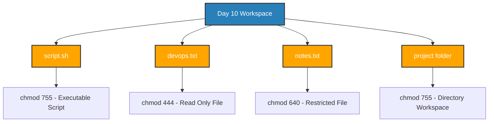

# 🐧 📄 $\color{red}\text{\textbf{Day 10:}}$ Linux File Permissions and File Operations

## 📌 Overview

Day 10 focuses on mastering **Linux File Permissions (`rwx`)**, basic file operations (`touch`, `cat`, `head`, `tail`, `vim`), octal permission math, and testing system security boundaries when permissions are restricted.

Understanding file permissions is foundational to SRE and DevOps practices—ensuring that services, scripts, and configuration files adhere to the **Principle of Least Privilege (PoLP)** in multi-tenant and production server environments.

---

## 📊 Day 10 File & Permission Architecture



---

## 🚀 Hands-On Challenge Summary

> [!NOTE]
> ### 🔵 Challenge Tasks Overview
> 
> 
> All tasks were performed in the Linux environment and documented step-by-step.

### 1. File Creation & Operations

* Created empty file `devops.txt` using `touch`.
* Created `notes.txt` with initial content using `echo`/`cat`.
* Created executable shell script `script.sh` using `vim` with the content `echo "Hello DevOps"`.

### 2. Reading & Viewing Files

* Inspected `notes.txt` content via `cat`.
* Opened `script.sh` in read-only mode via `view` / `vim -R`.
* Filtered system account entries using `head -n 5 /etc/passwd` and `tail -n 5 /etc/passwd`.

### 3. Understanding Permission Triads

Permissions are structured in 3 groups: **User (Owner)**, **Group**, and **Others**.

$$r = 4 \quad \vert{} \quad w = 2 \quad \vert{} \quad x = 1$$

| File / Folder | Octal Value | Symbolic Notation | Access Breakdown |
| --- | --- | --- | --- |
| **`script.sh`** | `755` | `-rwxr-xr-x` | Owner: `rwx`, Group: `r-x`, Others: `r-x` |
| **`devops.txt`** | `444` | `-r--r--r--` | Read-only for all user categories |
| **`notes.txt`** | `640` | `-rw-r-----` | Owner: `rw-`, Group: `r--`, Others: `---` |
| **`project/`** | `755` | `drwxr-xr-x` | Directory navigable and readable by group/others |

### 4. Permission Error Testing

* **Write to Read-Only File:** Attempting `echo "data" >> devops.txt` triggered `bash: devops.txt: Permission denied`.
* **Executing Non-Executable Script:** Revoking execute rights (`chmod -x script.sh`) and running `./script.sh` triggered `bash: ./script.sh: Permission denied`.

---

## 📂 Repository Artifacts

```text
Day-10/
├── README.md                   # Core module documentation and task summary
├── day-10-file-permissions.md  # Detailed challenge submission report
├── cheatsheet.md               # Quick command and permission calculation reference
└── files/                      # Task source files directory
    ├── devops.txt              # Read-only test file (chmod 444)
    ├── notes.txt               # Group-restricted notes file (chmod 640)
    ├── script.sh               # Executable bash script (chmod 755)
    └── project/                # Team workspace directory (chmod 755)
```
---

## 💡 Key Takeaways

1. **Least Privilege Principle:** Production files should only have the minimum permissions necessary for execution or reading.
2. **Never Use `777`:** Setting `777` exposes files to write and execution risks by any unauthorized local user.
3. **Directory vs. File Execution:** The execute bit (`x`) on a directory allows entering (`cd`) and traversing it, whereas on a file it grants binary/script execution.

---
