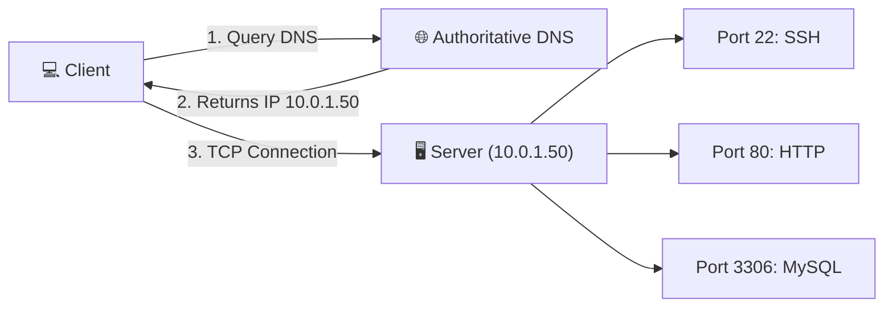

# Day 15: Networking Concepts — DNS, IP, Subnets & Ports

Welcome to **Day 15** of the Production-Ready DevOps & SRE Journey! 🚀

This module covers the core networking building blocks essential for designing cloud infrastructure, managing subnets, and troubleshooting service connectivity.

---

## 📌 What's Covered

* **DNS Architecture:** Domain resolution flow, record types (`A`, `AAAA`, `CNAME`, `MX`, `NS`), and TTL.
* **IP Addressing:** IPv4 structure, public vs. private IPs (RFC 1918), and loopback interfaces.
* **CIDR & Subnetting:** Network/host bit breakdown, subnet masks, and calculating usable host ranges.
* **Ports & Multiplexing:** Understanding service port mappings and socket listening states.

---

## 🗺️ Architectural Overview

### DNS Resolution & Service Port Mapping



---

## 📂 Module Files

* 📄 **`01-Day-15-networking-concepts.md`** — Detailed explanations, challenge task answers, command outputs, and CIDR calculations.
* 📄 **`cheat-sheet.md`** — Quick-reference guide with lookup tables and incident response CLI commands.

---

*Part of the **#ProductionReadyDevOpsSRE** 90-Day Challenge.*

```

```
