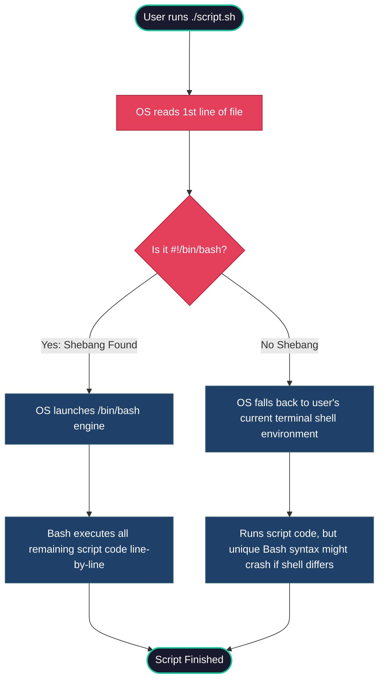

# Day 16 – Shell Scripting Basics


## Task
Start your shell scripting journey — learn the fundamentals every script needs.

You will:
- Understand **shebang** (`#!/bin/bash`) and why it matters
- Work with **variables**, **echo**, and **read**
- Write basic **if-else** conditions




---

## Challenge Tasks

### Task 1: Your First Script
1. Create a file `hello.sh`
2. Add the shebang line `#!/bin/bash` at the top
3. Print `Hello, DevOps!` using `echo`
4. Make it executable and run it

```bash
chmod +x hello.sh
./hello.sh

```

**Script Code (`hello.sh`):**

```bash
#!/bin/bash
# Description: Print a simple greeting message
echo "Hello, DevOps!"

```

**Execution & Output:**

```bash
$ chmod +x hello.sh
$ ./hello.sh
Hello, DevOps!

```


**What happens if you remove the shebang line?**

If you remove `#!/bin/bash`, the script will still execute in most standard environments because the active shell (such as Bash or Zsh) defaults to using its own interpreter. However:

* The script relies entirely on the invoking shell environment instead of an explicitly designated interpreter.
* If run under a different shell (e.g., `dash`, `zsh`, `fish`), Bash-specific syntax may fail or produce unexpected results.
* Explicitly including `#!/bin/bash` guarantees consistent, predictable execution across diverse platforms and systems.

---

### Task 2: Variables

1. Create `variables.sh` with:
* A variable for your `NAME`
* A variable for your `ROLE` (e.g., "DevOps Engineer")
* Print: `Hello, I am <NAME> and I am a <ROLE>`


2. Try using single quotes vs double quotes — what's the difference?

**Script Code (`variables.sh`):**

```bash
#!/bin/bash
# Description: Demonstrate variables and quote differences

NAME="NB11ML"
ROLE="Site Reliability Engineer"

# Double quotes allow variable expansion
echo "Hello, I am $NAME and I am a$ROLE"

# Single quotes treat text literally
echo 'Hello, I am $NAME and I am a$ROLE'

```

**Execution & Output:**

```bash
$ chmod +x variables.sh
$ ./variables.sh
Hello, I am NB11ML and I am a Site Reliability Engineer

```


**Difference between single quotes (`'...'`) and double quotes (`"..."`):**

* **Double Quotes (`"`):** Support variable expansion (e.g., `$NAME` evaluates to `NB11ML`) and command evaluation.
* **Single Quotes (`'`):** Treat all enclosed characters as literal strings, suppressing variable expansion completely.

---

### Task 3: User Input with `read`

1. Create `greet.sh` that:
* Asks the user for their name using `read`
* Asks for their favourite tool
* Prints: `Hello <name>, your favourite tool is <tool>`


**Script Code (`greet.sh`):**

```bash
#!/bin/bash
# Description: Take user inputs and print a personalized message

read -p "Enter your name: " NAME
read -p "Enter your favourite tool: " TOOL

echo "Hello $NAME, your favourite tool is $TOOL"

```

**Execution & Output:**

```bash
$ chmod +x greet.sh
$ ./greet.sh
Enter your name: NB11ML
Enter your favourite tool: VSCode
Hello NB11ML, your favourite tool is VSCode

```


---

### Task 4: If-Else Conditions

#### 1. Check Number Script (`check_number.sh`)

* Takes a number using `read`
* Prints whether it is **positive**, **negative**, or **zero**

**Script Code (`check_number.sh`):**

```bash
#!/bin/bash
# Description: Determine if a given number is positive, negative, or zero

read -p "Enter a number: " NUM

if (( NUM > 0 )); then
    echo "The number $NUM is positive."
elif (( NUM < 0 )); then
    echo "The number $NUM is negative."
else
    echo "The number is zero."
fi

```

**Execution & Output:**

```bash
$ chmod +x check_number.sh
$ ./check_number.sh
Enter a number: 11
The number 15 is positive.

$ ./check_number.sh
Enter a number: -9
The number -7 is negative.

$ ./check_number.sh
Enter a number: 0
The number is zero.

```


#### 2. File Check Script (`file_check.sh`)

* Asks for a filename
* Checks if the file **exists** using `-f`
* Prints appropriate message

**Script Code (`file_check.sh`):**

```bash
#!/bin/bash
# Description: Verify whether a file exists in the filesystem

read -p "Enter filename to check: " FILENAME

if [ -f "$FILENAME" ]; then
    echo "File '$FILENAME' exists."
else
    echo "File '$FILENAME' does not exist."
fi

```

**Execution & Output:**

```bash
$ chmod +x file_check.sh
$ ./file_check.sh
Enter filename to check: hello.sh
File 'hello.sh' exists.

$ ./file_check.sh
Enter filename to check: non_existent.txt
File 'non_existent.txt' does not exist.

```


---

### Task 5: Combine It All

Create `server_check.sh` that:

1. Stores a service name in a variable (e.g., `nginx`, `sshd`)
2. Asks the user: "Do you want to check the status? (y/n)"
3. If `y` — runs `systemctl status <service>` and prints whether it's **active** or **not**
4. If `n` — prints "Skipped."

**Script Code (`server_check.sh`):**

```bash
#!/bin/bash
# Description: Interactive service health status checker

read -p "Enter service name: " SERVICE
read -p "Please verify you want to check status of $SERVICE: " RESPONSE

if [[ "$RESPONSE" == [yY] ]]; then
    echo "Checking status for service: $SERVICE..."
    if systemctl is-active --quiet "$SERVICE"; then
        echo "Service '$SERVICE' is ACTIVE."
    else
        echo "Service '$SERVICE' is NOT Active."
    fi
elif [[ "$RESPONSE" == [nN] ]]; then
    echo "Skipped."
else
    echo "Invalid response. Please Enter 'y' or 'n'."
fi 

```

**Execution & Output:**

```bash
$ ./server_check.sh
Enter service name: sshd
Please verify you want to check status of sshd: Y
Checking status for service: sshd...
Service 'sshd' is ACTIVE.

$ ./server_check.sh
Enter service name: sshd
Please verify you want to check status of sshd: n
Skipped.

```

---


## Key Learnings

1. **Importance of Shebang (`#!/bin/bash`):**
The shebang line explicitly declares which interpreter should execute the script, guaranteeing cross-platform consistency across Linux environments.
2. **Quoting Rules and Variables:**
Variable assignments in Bash require strict syntax with no spaces around `=`. Double quotes (`"..."`) allow variable interpolation, whereas single quotes (`'...'`) treat contents as literal text.
3. **Conditional Statements & Evaluation:**
Using standard conditional constructs (`if [ condition ]; then ... fi`) allows scripts to perform dynamic operations based on file attributes (`-f`), string equality (`=`), or numerical comparison flags (`-gt`, `-lt`).

---

## Hints Reference

* Shebang: `#!/bin/bash` tells the system which interpreter to use
* Variables: `NAME="MB11ML` (no spaces around `=`)
* Read: `read -p "Enter name: " NAME`
* If syntax: `if [ condition ]; then ... elif ... else ... fi`
* File check: `if [ -f filename ]; then`

---

## Submission Workflow

```bash
mkdir -p 2026/day-16/
# Move scripts and day-16-shell-scripting.md into 2026/day-16/
chmod +x 2026/day-16/*.sh

git add 2026/day-16/
git commit -m "Add Day 16 Shell Scripting Basics scripts and documentation"
git push origin main

```

---
