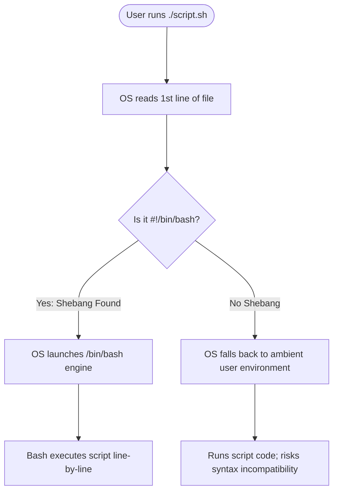

# Day 16 – Shell Scripting Basics 🚀

Welcome to Day 16 of the **Production-Ready DevOps & SRE Journey**. This directory contains foundational bash scripts, structural logic breakdowns, and comprehensive cheat sheets to kickstart automation workflows.

---

## 📋 Directory Contents

| Component / File | Description | Focus Area |
| :--- | :--- | :--- |
| 📂 [scripts/](scripts) | Directory housing interactive challenge scripts | Operational Practice |
| 📄 [01-Day-16-shell-scripting.md](01-Day-16-shell-scripting.md) | Practical labs documentation and challenges task list | Fundamentals Documentation |
| 📄 [02-Day-16-Cheat-Sheat.md](02-Day-16-Cheat-Sheat.md) | Advanced quick-reference operator and syntax guides | Reference Manual |

---

## 💡 Core Concept Summary

### The Role of a Shebang (`#!/bin/bash`)
The shebang line explicitly declares which interpreter should execute the script, guaranteeing cross-platform consistency across diverse Linux environments.



### Quoting Operations Table
| Quoting Variant | Operation Mechanics | Operational Result |
| :--- | :--- | :--- |
| **Double Quotes (`"..."`)** | Supports structural variable expansion | Evaluates variables like `$NAME` directly into values |
| **Single Quotes (`'...'`)** | Treats enclosed text as strict literal values | Completely suppresses variable expansion |

---

## 🛠️ Challenge Tasks Summary

1. **`hello.sh`**: Simple DevOps greeting message setup utilizing echo outputs.
2. **`variables.sh`**: Variable assignment validations mapping text strings.
3. **`greet.sh`**: Capturing active user data strings via `read -p`.
4. **`check_number.sh`**: Conditional block executing numerical analysis via arithmetic evaluations `(( ))`.
5. **`file_check.sh`**: Structural conditional testing verifying system file traits with `[ -f ]`.
6. **`server_check.sh`**: DevOps integration checking background service status safely using `systemctl is-active --quiet`.

---

## 🚀 Execution & Deployment Workflow

### 1. Set Permissions Locally
Make sure scripts are executable before launching:
```bash
chmod +x scripts/*.sh
```

### 2. Standard Workspace Workflow
```bash
# Form the designated deployment directory tree
mkdir -p 2026/day-16/

# Package up scripts and document metrics
git add 2026/day-16/
git commit -m "Add Day 16 Shell Scripting Basics scripts and documentation"
git push origin main
```
