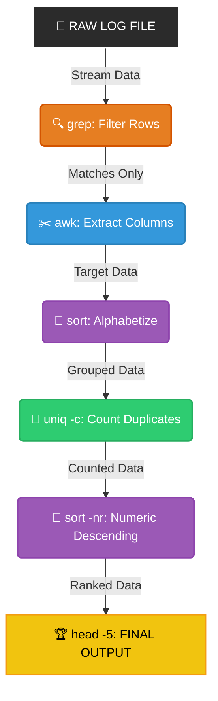

# 🐚 Shell Scripting Cheat Sheet: The SRE & DevOps Guide


Progress: [███████░░░░░░░░░░░░░░░░░] 21/90 Days Completed

A quick-reference guide for bash scripting, text processing, and system automation.

## ⚡ Quick Reference Table

| Topic | Key Syntax | Example |
| :--- | :--- | :--- |
| **Variable** | `VAR="value"` | `NAME="DevOps"` |
| **Argument** | `$1`, `$2` | `./script.sh arg1` |
| **If** | `if [ condition ]; then` | `if [ -f file ]; then` |
| **For loop** | `for i in list; do` | `for i in 1 2 3; do` |
| **Function** | `name() { ... }` | `greet() { echo "Hi"; }` |
| **Grep** | `grep pattern file` | `grep -i "error" log.txt` |
| **Awk** | `awk '{print $1}' file` | `awk -F: '{print $1}' /etc/passwd` |
| **Sed** | `sed 's/old/new/g' file` | `sed -i 's/foo/bar/g' config.txt` |

---

## 1. 🏗️ Basics

### Shebang (`#!/bin/bash`)
Tells the operating system which interpreter to use to parse the script. It matters because it ensures consistent execution regardless of the user's default shell environment.

### Running a Script
Scripts must have execute permissions before running directly.
```bash
chmod +x script.sh    # Grants execution rights
./script.sh           # Runs the executable script in the current directory
bash script.sh        # Bypasses execute permissions by invoking bash directly

```

### Comments & Variables

Use `#` for comments. Variables do not use spaces around the `=`.
Double quotes (`"`) allow variable expansion, while single quotes (`'`) treat everything as a literal string.

```bash
# This is an inline comment
VAR="World"
echo "Hello $VAR"    # Outputs: Hello World (Evaluates variable)
echo 'Hello $VAR'    # Outputs: Hello $VAR (Literal string)

```

### Reading User Input & Command-Line Arguments

```bash
read -p "Enter your name: " name   # Prompts user and assigns input to $name
echo "Script Name: $0"             # $0 is the script's own filename
echo "First Argument: $1"          # $1, $2, etc., represent positional arguments
echo "Total Arguments: $#"         # The total number of arguments passed
echo "All Arguments: $@"           # Returns all arguments as a single list
echo "Last Exit Code: $?"          # Returns 0 if the last command succeeded

```

---

## 2. ⚖️ Operators & Conditionals

### String Comparisons

Used to compare text values or check if strings are empty.

```bash
[ "$a" = "$b" ]    # True if strings are exactly equal
[ "$a" != "$b" ]   # True if strings are NOT equal
[ -z "$a" ]        # True if string is Zero length (empty)
[ -n "$a" ]        # True if string is Non-zero length (has content)

```

### Integer Comparisons

Used strictly for comparing numeric values.

```bash
[ $a -eq$b ]      # Equal to
[ $a -ne$b ]      # Not equal to
[ $a -lt$b ]      # Less than (-gt for Greater than)
[ $a -le$b ]      # Less than or equal to (-ge for Greater than or equal to)

```

### File Test Operators

Used to verify the existence, type, or permissions of files/directories.

```bash
[ -f file.txt ]    # True if it exists and is a regular file
[ -d /dir/ ]       # True if it is a directory
[ -e /path/ ]      # True if it exists at all (file or directory)
[ -r file.txt ]    # True if file is readable (-w for writable, -x for executable)
[ -s file.txt ]    # True if file size is > 0 (not empty)

```

### Conditionals & Logic

Evaluate conditions and control script flow using `if/elif/else`, logical operators `&&` (AND), `||` (OR), `!` (NOT), and `case` statements.

```bash
if [ -f "config.yml" ] && [ ! -z "$ENV" ]; then
    echo "File exists AND environment is set."
elif [ "$ENV" = "prod" ] \vert{}\vert{} [ "$ENV" = "staging" ]; then
    echo "Valid environment, but no config file."
else
    echo "Invalid state."
fi

# Case statements are excellent for parsing script options
case "$1" in
    start) echo "Starting..." ;;
    stop)  echo "Stopping..." ;;
    *)     echo "Usage: $0 {start|stop}" ;;
esac

```

---

## 3. 🔄 Loops

### For Loops

Iterate over a specific list of items, or count using C-style syntax.

```bash
for file in *.log; do       # Loops over all matching files in directory
    echo "Reading $file"
done

for ((i=1; i<=5; i++)); do  # C-style numeric loop
    echo "Count: $i"
done

```

### While & Until Loops

`while` loops run as long as a condition remains TRUE. `until` loops run as long as a condition is FALSE.

```bash
# Looping over command output line-by-line
cat data.txt | while read line; do
    echo "Processing: $line"
done

# Wait until a process finishes or a file appears
until [ -f "ready.flag" ]; do
    sleep 5
done

```

### Loop Control

```bash
break      # Instantly exits the entire loop
continue   # Skips the rest of the current loop iteration and moves to the next

```

---

## 4. 🛠️ Functions

### Defining, Calling, and Local Variables

Functions group commands together. `local` variables ensure data doesn't leak into the global script scope.

```bash
check_status() {
    local service_name=$1    # $1 inside a function is the first argument passed to it
    echo "Checking $service_name..."
}

check_status "nginx"         # Calling the function with an argument

```

### Return Values (`return` vs `echo`)

Use `return` to send a success/failure exit code (0-255). Use `echo` to return actual text data that can be captured in a variable.

```bash
is_root() {
    [ $(id -u) -eq 0 ] && return 0 || return 1
}

get_date() {
    echo $(date +%F)
}
CURRENT_DATE=$(get_date)

```

---

## 5. ✂️ Text Processing Commands



* **`grep` (Search patterns):**
* `-i` (ignore case), `-r` (recursive dir search), `-c` (count matches).
* `-n` (show line numbers), `-v` (invert match - exclude pattern).
* `-E` (extended regex for multiple patterns like `"ERROR|WARN"`).


* **`awk` (Column and field processing):**
* `awk -F, '{print $2}'` (Set delimiter to comma, print 2nd column).
* `awk 'BEGIN {print "Start"} {print $1} END {print "Done"}'` (Run commands before/after processing).


* **`sed` (Stream Editor for substitution):**
* `sed 's/old/new/g' file` (Replace 'old' with 'new' globally on stdout).
* `sed -i 's/old/new/g' file` (Edit the file in-place and save).
* `sed '/debug/d' file` (Delete all lines containing 'debug').


* **`cut` (Extract data):** `cut -d: -f1 /etc/passwd` (Extract field 1 using `:` as a delimiter).
* **`sort`:** `-n` (numerical), `-r` (reverse), `-u` (unique).
* **`uniq`:** `-c` (count adjacent duplicate lines; always use `sort` before `uniq`).
* **`tr`:** `tr 'a-z' 'A-Z'` (Translate characters), `tr -d ' '` (Delete characters).
* **`wc`:** `-l` (line count), `-w` (word count), `-c` (character count).
* **`head` / `tail`:** `head -n 5` (first 5 lines), `tail -f log.txt` (follow log in real-time).

---

## 6. 🔥 Useful Patterns & One-Liners

**1. Find and delete files older than N days (e.g., 7 days):**

```bash
find /var/log/backups -type f -mtime +7 -exec rm -f {} \;

```

**2. Count lines in all `.log` files in a directory:**

```bash
find /var/log -name "*.log" -exec wc -l {} +

```

**3. Replace a string across multiple files at once:**

```bash
sed -i 's/127.0.0.1/10.0.0.5/g' /etc/nginx/sites-available/*.conf

```

**4. Check if a service is running without outputting text walls:**

```bash
systemctl is-active --quiet docker && echo "Docker is running" || echo "Docker is down"

```

**5. Monitor disk usage and trigger a basic alert if over 80%:**

```bash
[ $(df / | awk 'NR==2 {print $5}' | tr -d '%') -gt 80 ] && echo "CRITICAL: Disk Space > 80%"

```

**6. Parse JSON or CSV from the command line:**

```bash
jq '.database.port' config.json          # Extracting JSON value using jq
awk -F, '{print $1, $3}' users.csv       # Extracting columns 1 and 3 from a CSV

```

**7. Tail a log and filter for specific errors in real-time:**

```bash
tail -f /var/log/syslog | grep --line-buffered -iE "error|critical|failed"

```

---

## 7. 🐛 Error Handling & Debugging

### Exit Codes & Safety Flags

Bash scripts continue running even if commands fail. These flags force safe execution.

```bash
exit 0            # Marks successful execution. Use 'exit 1' (or up to 255) for errors.
set -e            # Instantly exits the script if any command returns a non-zero (failure) code.
set -u            # Treats uninitialized variables as errors and exits immediately.
set -o pipefail   # Ensures if ANY command in a pipeline fails (cmd1 | cmd2), the whole pipeline fails.

```

### Tracing and Traps

```bash
set -x            # Debug mode: Prints every command (expanded) to the terminal before running it.
set +x            # Turns off debug mode.

# Trap: Ensures a cleanup command runs when the script exits, even if it crashed.
trap 'echo "Cleaning up temporary files..."; rm -f /tmp/lockfile' EXIT

```

```

```
