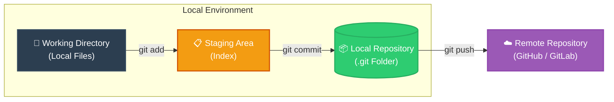

# 📌 Day 22: Introduction to Git & Version Control Core

## 🎯 Overview
Today marks the official entry into **Version Control Systems (VCS)**—the foundation of modern DevOps, CI/CD pipelines, and collaborative software engineering. Day 22 focuses on setting up a clean Git environment, exploring internal structures like the `.git` directory, mastering the standard three-stage architecture, and maintaining a clean commit history.

---

## 🛠️ Challenge Tasks Walkthrough

### Task 1: Install and Configure Git
Verify installation and set global user metadata:

```bash
# Verify Git installation
git --version

# Set global identity configuration
git config --global user.name "Your Name"
git config --global user.email "your.email@example.com"

# Verify configuration settings
git config --list

```

---

### Task 2: Project Initialization & Internal Inspection

```bash
# Create project workspace
mkdir devops-git-practice && cd devops-git-practice

# Initialize local Git repository
git init

# Check repository state
git status

# Inspect hidden .git metadata directory
ls -la .git/

```

  

---

> **🔍 What's inside `.git/`?**
> * `HEAD`: Points to the currently checked-out branch/commit.
> * `config`: Repository-specific configuration options.
> * `hooks/`: Client-side/server-side event scripts.
> * `objects/`: The database storing blobs, trees, and commits.
> * `refs/`: Pointers to heads (branches) and tags.
> 
> 

---

### Tasks 3, 4 & 5: Building History & Commands Reference

Created `git-commands.md`, edited the file iteratively, staged changes, and built a multi-commit tracking history:

```bash
# 1. Create commands reference document and make initial commit
touch git-commands.md
git add git-commands.md
git commit -m "docs: initialize git commands reference guide"

# 2. Add setup and configuration commands, then commit
echo "# Setup & Config" >> git-commands.md
echo "git config --global user.name - Set global username" >> git-commands.md
git add git-commands.md
git commit -m "feat: add setup and config commands to reference"

# 3. Add basic workflow commands, then commit
echo -e "\n# Basic Workflow" >> git-commands.md
echo "git status - Check working tree state" >> git-commands.md
git add git-commands.md
git commit -m "feat: add workflow and staging commands"

# 4. Add inspection and logging commands, then commit
echo -e "\n# Viewing Changes & Logs" >> git-commands.md
echo "git log --oneline - View compact commit history" >> git-commands.md
git add git-commands.md
git commit -m "docs: add inspection and logging commands"

```

#### 📜 Compact Commit Log Verification (`git log --oneline`)

```text
a1b2c3d (HEAD -> master) docs: add inspection and logging commands
e4f5g6h feat: add workflow and staging commands
i7j8k9l feat: add setup and config commands to reference
7ed544c docs: initialize git commands reference guide

```


---

## 💡 Task 6: Key Git Concepts & Conceptual Q&A

### 1. What is the difference between `git add` and `git commit`?

* **`git add`**: Moves tracked or untracked changes from the **Working Directory** to the **Staging Area** (Index). It prepares specific snapshots without permanently saving them into the history database.
* **`git commit`**: Takes the staged snapshot from the **Staging Area** and permanently writes it as a immutable commit object into the **Git Repository database (`.git/objects`)**, generating a unique SHA-1/SHA-256 hash.

---

### 2. What does the staging area do? Why doesn't Git just commit directly?

The **Staging Area (Index)** acts as a preparation canvas between your workspace and commit history.

**Why Git uses staging instead of committing directly:**

* **Granular Control:** Allows you to bundle related changes together into clean, logical commits rather than dumping every modified file at once.
* **Review Mechanism:** Provides a chance to inspect changes using `git diff --staged` before locking them permanently into project history.
* **Partial Commits:** Supports staging specific lines/chunks of code (`git add -p`) across files.

---

### 3. What information does `git log` show you?

`git log` displays the chronological history of commits within the current branch. Key metadata included:

* **Commit Hash:** Unique identifier (e.g., `a1b2c3d4...`).
* **Author Details:** Name and Email of the contributor.
* **Timestamp:** Date and time the commit was recorded.
* **Commit Message:** Description explaining *why* changes were made.
* **Pointers:** Current location of `HEAD` and branch tags.

---

### 4. What is the `.git/` folder and what happens if you delete it?

The `.git/` directory is the **hidden core database** created when initializing a project (`git init`). It stores all tracking information, object databases, configuration settings, branch pointers, and commit history.

⚠️ **If you delete `.git/`:**

* Your project instantly loses **all version history, branches, tags, and commits**.
* The folder reverts to a regular local directory with no Git tracking.
* The local files remain in their current state, but all past snapshots become unrecoverable.

---

### 5. What is the difference between Working Directory, Staging Area, and Repository?

| Architecture Layer | Description | Git State |
| --- | --- | --- |
| **Working Directory** | Local sandbox directory containing actual project files on disk. | *Modified / Untracked* |
| **Staging Area (Index)** | Intermediate cache storing files ready for the next commit snapshot. | *Staged* |
| **Git Repository (`.git`)** | Local database permanently storing all commit objects, history, and references. | *Committed* |

---

## 📊 Visual Workflow Diagram



---

## 🛠️ Summary of Git Commands Used Today

* `git config --global user.name` – Set global username identity.
* `git config --global user.email` – Set global email identity.
* `git init` – Initialize a new local Git repository.
* `git status` – Display state of working directory and staging area.
* `git add <file>` – Stage specific file for upcoming commit.
* `git commit -m "msg"` – Permanently record staged snapshot to database.
* `git log` – View complete commit history.
* `git log --oneline` – View condensed, single-line commit history.

---

### 👤 Author Metadata

* **Author:** Neeraj Bali
* **Date:** Day 22 / 90 Days DevOps Journey
* **Repository:** [Production-Ready DevOps & SRE Journey](https://www.google.com/search?q=https://github.com/NB11-ML/Production-Ready-DevOps-SRE-Journey)

```

```
