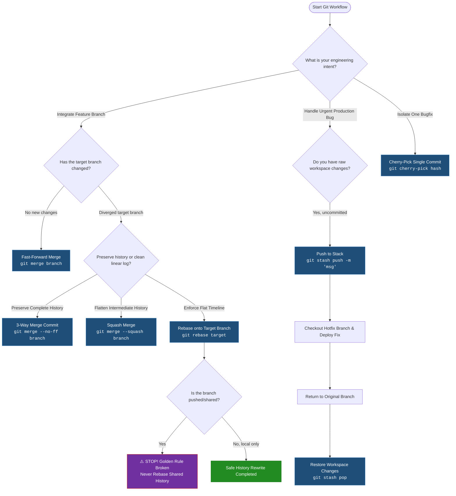

## Day 24: Advanced Git Integration Patterns
Welcome to the Day 24 module of the Production-Ready DevOps & SRE Journey, focusing on advanced branch integration, context switching, and selective commit extraction.
## 📁 Directory Structure

* 01-Day-24-Notes.md: Detailed concepts and technical Q&As.
* 02-Day-24-Cheat-Sheet.md: Compressed reference guide.

## 🗺️ Architectural Workflow

This interactive Mermaid diagram maps out the core integration pathways covered in this module, detailing when to deploy specific Git integration strategies based on development scenarios:

---

## 🚀 Key Topics Covered

   1. Git Merge Operations: Covers Fast-Forward, 3-Way, and Squash merges.
   2. Rebase & Timeline Linearization: History rewrite mechanics and the golden rule of rebasing shared branches.
   3. Context Switching: Shelving work via the stash stack (pop vs apply).
   4. Cherry-Picking: Pulling isolated commits into production tracks.
