# :octocat: Day 26: GitHub CLI (`gh`)

## 📌 Overview
Context switching between your terminal and the browser reduces engineering velocity during daily DevOps operations. The **GitHub CLI (`gh`)** embeds repository management, issue triage, pull request workflows, and GitHub Actions monitoring directly into your command-line environment. 

This module covers interactive and non-interactive authentication methods, operational automation for repositories/PRs, pipeline log streaming, and API integrations essential for SRE/DevOps automation pipelines.

---

## 🏗️ Architecture & Operational Flow

The sequence diagram below demonstrates how `gh` eliminates browser context switching by directly interacting with GitHub's REST and GraphQL APIs to manage code reviews and CI/CD pipelines:

```mermaid

sequenceDiagram
    autonumber
    actor Engineer as DevOps / SRE Engineer
    participant Terminal as Local Terminal (gh CLI)
    participant API as GitHub API
    participant Pipeline as GitHub Actions CI/CD

    rect rgb(30, 41, 59)
        note over Engineer, API: Phase 1: Authentication & Scope Verification
        Engineer->>Terminal: gh auth login (PAT / OAuth)
        Terminal->>API: Validate Token Scopes (repo, workflow)
        API-->>Terminal: 200 OK (Session Active)
    end

    rect rgb(15, 23, 42)
        note over Engineer, API: Phase 2: Terminal-Based PR Creation
        Engineer->>Terminal: gh pr create --fill
        Terminal->>API: POST /repos/{owner}/{repo}/pulls
        API-->>Terminal: PR #42 Created
    end

    rect rgb(30, 41, 59)
        note over Engineer, Pipeline: Phase 3: Live Pipeline Observability
        Engineer->>Terminal: gh run watch
        Terminal->>Pipeline: Stream Pipeline Execution Logs
        Pipeline-->>Terminal: Live Status: Passed (0 Exit Code)
    end

    rect rgb(15, 23, 42)
        note over Engineer, API: Phase 4: Merge & Remote Branch Cleanup
        Engineer->>Terminal: gh pr merge 42 --squash --delete-branch
        Terminal->>API: PUT /repos/{owner}/{repo}/pulls/42/merge
        API-->>Terminal: Branch Merged & Remote Deleted
    end

```



---

## 🚀 Terminal vs. Browser Workflow Comparison

```mermaid
graph LR
    subgraph LegacyWorkflow [Browser Context Switching]
        A[Write Code] --> B[git push]
        B --> C[Open Web Browser]
        C --> D[Navigate to Repo URL]
        D --> E[Click 'Compare & Pull Request']
        E --> F[Manually Fill Form & Submit]
    end

    subgraph DevOpsLoop [CLI Automation]
        G[Write Code] --> H[git push -u origin branch]
        H --> I["gh pr create --fill"]
        I --> J["gh pr merge --squash --delete-branch"]
    end

    style DevOpsLoop fill:#1f2937,stroke:#10b981,stroke-width:2px
    style LegacyWorkflow fill:#1f2937,stroke:#ef4444,stroke-width:1px

```



---

## 🛠️ Core Capabilities Covered

### 1. Authentication Modes

* **Interactive OAuth:** Web device authorization flow (`gh auth login`).
* **Non-Interactive PAT:** Automated pipeline authentication via environment variables (`GH_TOKEN`).

### 2. Repository & Issue Management

* Programmatic repository initialization (`gh repo create --public --clone`).
* Command-line issue triage, labeling, and automated resolution (`gh issue create`, `gh issue close`).

### 3. PR Lifecycle & CI/CD Observability

* Fast PR creation auto-filling title/body from commit messages (`gh pr create --fill`).
* Terminal PR testing (`gh pr checkout <id>`) and squashed merges with automated branch cleanup (`gh pr merge --squash --delete-branch`).
* Pipeline execution log tailing (`gh run watch`).

---

## 📂 Day 26 File Structure

| File | Description |
| --- | --- |
| 01-Day-26-Notes.md | Complete step-by-step execution logs, technical Q&A, and troubleshooting records. |
| 02-Day-26-Cheat-Sheet.md | Central reference sheet updated with production-ready `gh` commands. |

---

## ⚡ Quick Start: Essential Commands

```bash
# Verify active authentication status
gh auth status

# Create issue directly from terminal
gh issue create --title "bug: database timeout" --body "Detailed logs..." --label "bug"

# Create, view, and merge PRs
gh pr create --fill
gh pr status
gh pr merge --squash --delete-branch

# Stream CI/CD pipeline runs
gh run list
gh run watch <run-id>

```
