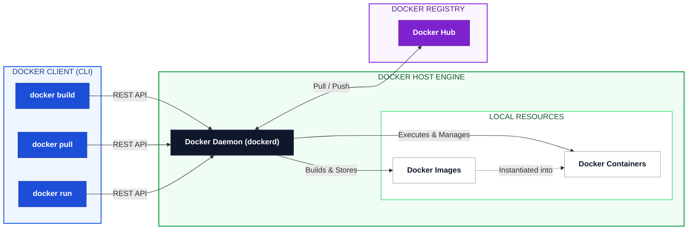

# 🐳 Day 29: Introduction to Docker

## 🎯 Task 1: What is Docker?

**What is a container and why do we need them?**

A container is a standard unit of software that packages up code and all its dependencies so the application runs quickly and reliably from one computing environment to another. We need them to eliminate the "it works on my machine" problem, ensuring consistency across development, testing, and production environments.

**📦 Containers vs 💻 Virtual Machines**

*   **Virtual Machines (VMs):** Include a full copy of an operating system, the application, necessary binaries, and libraries. They are heavy, slow to start, and consume significant system resources.
*   **Containers:** Share the host system's OS kernel and only contain the application and its dependencies. They are lightweight, start almost instantly, and use far fewer resources.

## Docker Architecture



### Docker uses a client-server architecture:

**The Docker client talks to the Docker daemon, which does the heavy lifting of building, running, and distributing your Docker containers.**

*   **Docker Daemon (`dockerd`):** The background service running on the host that manages building, running, and distributing containers.
*   **Docker Client (`docker`):** The CLI tool used to interact with the daemon (e.g., running `docker run`).
*   **Docker Images:** Read-only templates with instructions for creating a container.
*   **Docker Containers:** Runnable instances of an image.
*   **Docker Registry:** Stores Docker images (e.g., Docker Hub).

**Architecture Flow (Text Representation):**
`Client (CLI)` ➜ Sends REST API commands ➜ `Docker Host (Daemon)` ➜ Pulls from `Registry` ➜ Creates `Images` ➜ Runs `Containers`

---

## 🛠️ Task 2: Install Docker

**1. Installation (Linux/Ubuntu)**
```bash
sudo apt update
sudo apt install docker.io -y
sudo systemctl start docker
sudo systemctl enable docker
sudo usermod -aG docker $USER # Run Docker without sudo

```

**2. Verify Installation**

```bash
docker --version

```


**3. Run Hello-World**

```bash
docker run hello-world

```


*Observation:* Docker checks for the `hello-world` image locally. Not finding it, it pulls the image from Docker Hub, creates a container, runs the executable that prints a welcome message, and exits.

---

## 🚀 Task 3: Run Real Containers

**1. Run an Nginx Container**

```bash
docker run nginx

```


*Note: Press `Ctrl+C` to exit. This runs in the foreground, locking the terminal.*

**2. Run an Ubuntu Container Interactively**

```bash
docker run -it ubuntu /bin/bash

```


*Inside the container, run `cat /etc/os-release` to verify you are inside Ubuntu. Type `exit` to leave.*

**3. List Running Containers**

```bash
docker ps

```

**4. List All Containers (Including Stopped)**

```bash
docker ps -a

```


**5. Stop and Remove a Container**

```bash
docker stop <container_id>
docker rm <container_id>

```


---

## 🔍 Task 4: Explore

**1. Run a Container in Detached Mode**

```bash
docker run -d nginx

```

*The `-d` flag runs the container in the background and prints the container ID, leaving the terminal usable.*

**2. Give a Container a Custom Name**

```bash
docker run -d --name production-ready-web nginx

```

**3. Map a Port to the Host**

```bash
docker run -d --name production-ready-web-port -p 8080:80 nginx

```


*Access `http://localhost:8080` in your browser. Port 80 inside the container is mapped to port 8080 on the host.*

**4. Check Logs of a Running Container**

```bash
docker logs production-ready-web-port

```


**5. Run a Command Inside a Running Container**

```bash
docker exec -it production-ready-web-port /bin/bash

```


---
