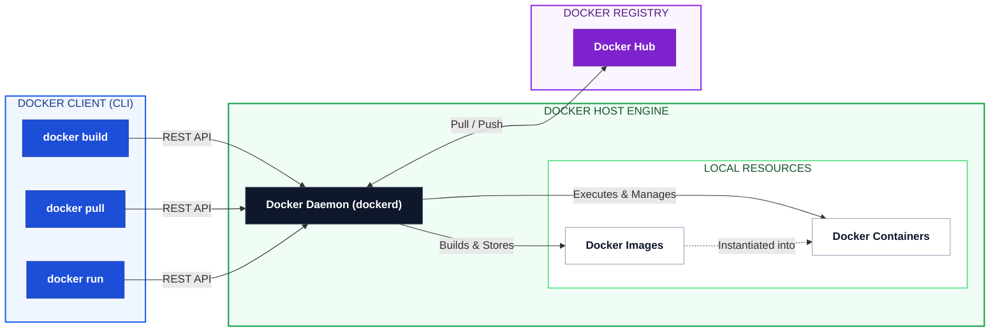

# 🐳 Day 29: Introduction to Docker & Containerization

> **Part of the 90-Day Production-Ready DevOps & SRE Journey**  
> *Transitioning from core OS fundamentals to modern containerized infrastructure.*

---

## 📌 Overview

Day 29 marks the start of the Containerization module. Having consolidated Linux administration, Shell scripting automation, and Git version control in Milestone 1, today focuses on packaging applications with **Docker**.

The primary objective is to understand container mechanics, explore the Docker architecture, install the runtime, and execute containerized workloads using interactive and detached modes, custom networking, and log inspection.

---

## 🎯 Key Learning Objectives

1. **Container Mechanics:** Understand why containers exist and how they differ from traditional Virtual Machines (Kernel sharing vs. Hypervisors).
2. **Docker Architecture:** Learn the interaction between the **Docker Client**, **Docker Daemon (`dockerd`)**, **Images**, **Containers**, and **Registries (Docker Hub)**.
3. **Hands-On Operations:**
   * Run containers in interactive (`-it`) and detached (`-d`) modes.
   * Configure host-to-container port forwarding (`-p`).
   * Inspect container logs (`docker logs`) and execute commands inside active environments (`docker exec`).

---

## 🏗️ Docker Client-Server Architecture



---

## 📂 File Directory

| File | Description |
| --- | --- |
| [`01-Day-29-Docker_Basics.md`](https://www.google.com/search?q=./01-Day-29-Docker_Basics.md) | Complete documentation covering Docker theories, VM comparisons, installation steps, and challenge tasks. |
| [`02-Day-29-CheatSheet.md`](https://www.google.com/search?q=./02-Day-29-CheatSheet.md) | Command reference guide covering container lifecycle management, flags, and debugging syntax. |

---

## ⚡ Quick Start / Core Commands

```bash
# 1. Verify Docker Runtime
docker --version

# 2. Run an Nginx Web Server in Detached Mode with Port Mapping
docker run -d --name prod-web -p 8080:80 nginx

# 3. Access Interactive Terminal in an Ubuntu Container
docker run -it ubuntu /bin/bash

# 4. Inspect Container Logs
docker logs prod-web

# 5. Execute Command inside Running Container
docker exec -it prod-web /bin/sh

# 6. Clean Up Running & Stopped Containers
docker stop prod-web
docker rm prod-web

```

---

## 🔗 Related Resources & References

* **Official Docs:** [Docker Documentation](https://www.google.com/search?q=https://docs.docker.com/)
* **Registry:** [Docker Hub](https://www.google.com/search?q=https://hub.docker.com/)
* **Parent Repository:** [Production-Ready DevOps & SRE Journey](https://www.google.com/search?q=../)

```
