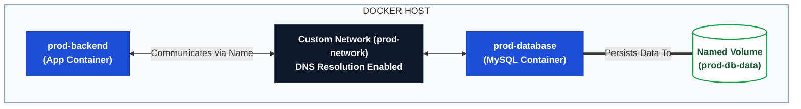

# 📦 Day 32: Docker Volumes & Networking

> **Part of the Production-Ready DevOps & SRE Journey**  
> *Solving the two biggest container challenges: Data Persistence and Inter-Container Communication.*

---

## 🎯 Task 1: The Ephemeral Problem

**Objective:** Prove that containers lose data when removed.

**1. Run a MySQL Container:**
```bash
docker run -d --name my-temp-db -e MYSQL_ROOT_PASSWORD=secret mysql:8.0

```


**2. Create Data Inside It:**

```bash
# Execute into the container and open the MySQL CLI
docker exec -it my-temp-db mysql -u root -psecret

# Inside MySQL:
CREATE DATABASE sre_test;
SHOW DATABASES;
exit;

```


**3. Destroy and Recreate:**

```bash
docker stop my-temp-db && docker rm my-temp-db
docker run -d --name my-temp-db -e MYSQL_ROOT_PASSWORD=secret mysql:8.0
docker exec -it my-temp-db mysql -u root -psecret -e "SHOW DATABASES;"

```


* **Result:** The `sre_test` database is gone.
* **Why it happened:** Containers are strictly ephemeral. Any files created inside a container are stored on a writable container layer. When the container is deleted, that writable layer is destroyed with it.

---

## 💾 Task 2 & 3: Volumes vs. Bind Mounts

### Task 2: Named Volumes (Docker-Managed)

Named volumes are stored in a part of the host filesystem which is completely managed by Docker (`/var/lib/docker/volumes/`).

```bash
# 1. Create the volume
docker volume create db_data

# 2. Run database WITH the volume attached
docker run -d --name my-persist-db -e MYSQL_ROOT_PASSWORD=secret -v db_data:/var/lib/mysql mysql:8.0

# 3. Add data, then delete the container
docker exec -it my-persist-db mysql -u root -psecret -e "CREATE DATABASE persist_test;"
docker stop my-persist-db && docker rm my-persist-db

# 4. Run a NEW container using the SAME volume
docker run -d --name my-new-db -e MYSQL_ROOT_PASSWORD=secret -v db_data:/var/lib/mysql mysql:8.0
docker exec -it my-new-db mysql -u root -psecret -e "SHOW DATABASES;"

```

* **Result:** The `persist_test` database survives!

### Task 3: Bind Mounts (Host-Managed)

Bind mounts rely on the host machine's specific directory structure. You control exactly where the data lives on your laptop/server.

```bash
# 1. Create a folder and an HTML file on your host machine
mkdir html_content && cd html_content
echo "<h1>Hello from the Host Machine!</h1>" > index.html

# 2. Run Nginx, binding your host folder to the container's web directory
docker run -d --name nginx-bind -p 8080:80 -v $(pwd):/usr/share/nginx/html nginx:alpine

```

* **Result:** If you edit `index.html` on your host machine, the changes reflect instantly in the browser at `http://localhost:8080`.

### 💡 SRE Notes: Named Volumes vs Bind Mounts

| Feature | Named Volume | Bind Mount |
| --- | --- | --- |
| **Managed By** | Docker Daemon | You (Host OS) |
| **Best For** | Database storage, persistent app data. | Injecting source code for local development. |
| **Portability** | High (Works identically across OSs). | Low (Depends on specific host file paths). |

---

## 🌐 Task 4 & 5: Docker Networking

### Task 4: The Default Bridge Problem

By default, Docker attaches containers to the `bridge` network.

```bash
# Run two containers on the default bridge
docker run -d --name container_A alpine sleep 3600
docker run -d --name container_B alpine sleep 3600

# Ping by IP (Works)
# (Assuming container_A is 172.17.0.2)
docker exec -it container_B ping 172.17.0.2

# Ping by Name (Fails!)
docker exec -it container_B ping container_A
# Output: ping: bad address 'container_A'

```

### Task 5: Custom Networks (The Solution)

Custom bridge networks come with a built-in DNS resolver.

```bash
# 1. Create a custom network
docker network create my-app-net

# 2. Run two containers on this network
docker run -d --name web_server --network my-app-net alpine sleep 3600
docker run -d --name app_server --network my-app-net alpine sleep 3600

# 3. Ping by Name (Works!)
docker exec -it app_server ping -c 2 web_server

```

* **SRE Notes:** The default bridge is considered a legacy feature. In production, **always** create custom networks. Custom networks provide automatic DNS resolution, meaning you never have to hardcode volatile IP addresses in your configuration files; you just use the container name.

---

## 🏗️ Task 6: Put It Together (Architecture Mockup)

Let's build a mini-production setup: A database with persistent storage, communicating with an app container over a secure custom network.

```bash
# 1. Create the shared network
docker network create prod-network

# 2. Create the persistent volume
docker volume create prod-db-data

# 3. Launch the Database
docker run -d \
  --name prod-database \
  --network prod-network \
  -v prod-db-data:/var/lib/mysql \
  -e MYSQL_ROOT_PASSWORD=supersecure \
  mysql:8.0

# 4. Launch the App (Using a temporary alpine container to test connection)
docker run -it --rm \
  --name prod-backend \
  --network prod-network \
  alpine sh

# 5. Inside the prod-backend container, verify connection to the database by name:
ping -c 2 prod-database
# Result: Successful ping replies from the database container!

```

---

## 🗺️ Visual Architecture Summary


