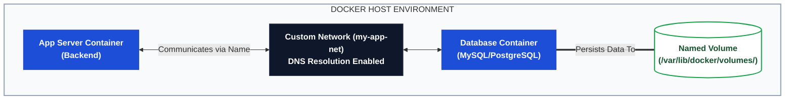

# 📦 Day 32: Docker Volumes & Networking

> **Part of the 90-Day Production-Ready DevOps & SRE Journey**  
> *Solving the two biggest container challenges: Ephemeral Data Loss and Inter-Container Communication.*

---

## 📌 Overview

Transitioning into a Site Reliability Engineering mindset requires a zero-tolerance policy for accidental data loss. Because containers are inherently ephemeral, any data written inside them vanishes when the container is destroyed. 

Day 32 tackles this by implementing **Docker Volumes** and **Bind Mounts** to persist stateful application data (like databases) safely on the host machine. Furthermore, we eliminate hardcoded IP addresses by establishing **Custom Bridge Networks**, enabling seamless, DNS-based communication between isolated microservices.

---

## 🎯 Key Learning Objectives

1. **Data Persistence:** 
   * Differentiate between Docker-managed **Named Volumes** (best for databases) and OS-managed **Bind Mounts** (best for local code injection).
   * Prove container ephemerality by destroying and recreating database environments.
2. **Container Networking:** 
   * Understand why the default `bridge` network is a legacy anti-pattern.
   * Create custom networks to enable automatic DNS resolution, allowing containers to `ping` and communicate via container names instead of volatile IP addresses.

---

## 🏗️ Architecture: Network & Storage Flow



---

## 📂 File Directory

| File | Description |
| --- | --- |
| [`01-Day-32-Volumes-Networking.md`](https://www.google.com/search?q=./01-Day-32-Volumes-networking.md) | Core documentation containing step-by-step experiments proving container ephemerality, volume creation, and network DNS resolution. |
| [`02-Day-32-CheatSheet.md`](https://www.google.com/search?q=./02-Day-32-CheatSheet.md) | Quick-reference SRE guide for volume management, network creation, and architectural decision matrices. |

---

## ⚡ Quick Start / Core Commands

```bash
# 1. Create a custom network for microservices
docker network create prod-network

# 2. Create a persistent named volume
docker volume create prod-db-data

# 3. Launch a stateful database container using both
docker run -d \
  --name prod-database \
  --network prod-network \
  -v prod-db-data:/var/lib/mysql \
  -e MYSQL_ROOT_PASSWORD=securepass \
  mysql:8.0

# 4. Connect a secondary container to the same network and test DNS
docker run -it --rm --network prod-network alpine ping prod-database

```

---

## 🔗 Related Resources & References

* **Official Docs:** [Docker Volumes](https://www.google.com/search?q=https://docs.docker.com/storage/volumes/) | [Docker Networking](https://www.google.com/search?q=https://docs.docker.com/network/)
* **Parent Repository:** [Production-Ready DevOps & SRE Journey](https://www.google.com/search?q=../)
