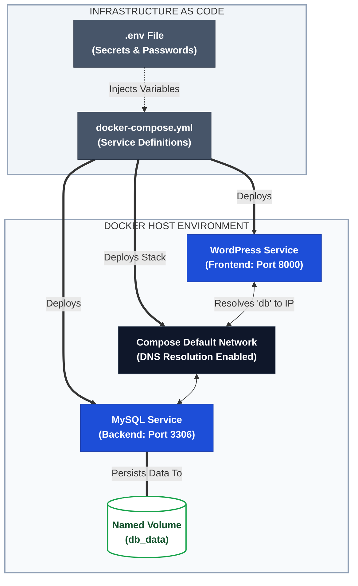

# 🐙 Day 33: Docker Compose – Multi-Container Orchestration

> **Part of the 90-Day Production-Ready DevOps & SRE Journey**  
> *Evolving from imperative manual commands to declarative Infrastructure as Code (IaC).*

---

## 📌 Overview

Managing single containers via the CLI is great for learning, but production applications are rarely just one container. They consist of frontend web servers, backend APIs, databases, and caching layers that all need to communicate securely. 

Day 33 introduces **Docker Compose**, a tool that allows engineers to define and run multi-container applications using a single, declarative `yaml` file. This transition marks the first real step into Infrastructure as Code, making environment setups reproducible, version-controllable, and easily scalable.

---

## 🎯 Key Learning Objectives

1. **Declarative Configuration:** Replace long, error-prone `docker run` commands with structured `docker-compose.yml` files.
2. **Automated Networking:** Understand how Compose automatically provisions a default bridge network and configures container names as resolvable DNS records.
3. **Multi-Tier Deployments:** Successfully orchestrate a connected WordPress frontend and MySQL database backend with persistent storage.
4. **Security Best Practices:** Decouple sensitive credentials from codebase configurations using `.env` files and environment variable injection.

---

## 🏗️ Architecture: Compose Orchestration Flow



---

## 📂 File Directory

| File | Description |
| --- | --- |
| [`01-Day-33-Compose.md`](https://www.google.com/search?q=./01-Day-33-Compose.md) | Comprehensive documentation covering the transition to Compose, WordPress/MySQL deployment, and `.env` security practices. |
| [`02-Day-33-CheatSheet.md`](https://www.google.com/search?q=./02-Day-33-CheatSheet.md) | Quick-reference SRE guide for `docker compose` commands, lifecycle management, and YAML syntax. |

---

## ⚡ Quick Start / Core Commands

```bash
# 1. Start the entire application stack in detached mode
docker compose up -d

# 2. View the running status of the current project's containers
docker compose ps

# 3. Stream combined live logs for debugging
docker compose logs -f

# 4. Gracefully tear down the stack (stops containers and removes networks)
docker compose down

```

---

## 🔗 Related Resources & References

* **Official Docs:** [Docker Compose Overview](https://www.google.com/search?q=https://docs.docker.com/compose/) | [Compose File Reference](https://www.google.com/search?q=https://docs.docker.com/compose/compose-file/)
* **Parent Repository:** [Production-Ready DevOps & SRE Journey](https://www.google.com/search?q=../)
