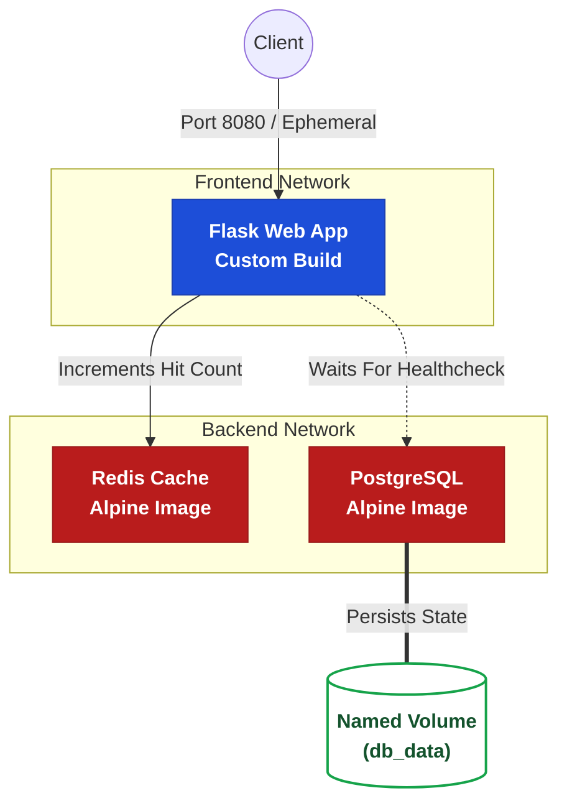

# 🚀 Day 34: Advanced Docker Compose Operations

> **Part of the Production-Ready DevOps & SRE Journey**  
> *Engineering resilient, self-healing, and production-like container stacks.*

---

## 📌 Overview & Objectives
Today's focus shifts from foundational orchestration to engineering resilient, real-world environments. A production application requires precise boot sequencing, segmented networking, and automated recovery mechanisms to maintain high availability and prevent cascading failures.

**Key Engineering Milestones:**
*   **Startup Sequencing:** Enforced strict boot dependencies using `service_healthy` conditions to prevent frontend crash loops.
*   **Self-Healing Infrastructure:** Implemented and validated `restart: always` and `on-failure` policies against simulated internal fatal crashes.
*   **Network Isolation:** Configured explicit `frontend` and `backend` bridge networks to completely isolate and secure backend data stores.
*   **Dynamic Scaling:** Resolved hardcoded port and naming conflicts to successfully scale web replicas using ephemeral host mapping.

---

## 🏗️ Architecture Diagram

---

## 📂 Project Structure

| File / Directory | Description |
| --- | --- |
| `app/` | Contains the custom Python application code, `requirements.txt`, and `Dockerfile`. |
| `docker-compose.yml` | The declarative infrastructure file defining the 3-tier stack, explicit networks, and healthchecks. |
| `01-Day-34-Compose-Advanced.md` | Comprehensive lab documentation detailing startup sequencing, simulated crashes, and scaling behaviors. |
| `02-Day-34-CheatSheet.md` | Quick-reference operational guide for advanced compose directives and scaling solutions. |

---

## ⚡ Core SRE Operations

* **Build & Deploy:** `docker compose up -d --build` (Forces a fresh image compilation before provisioning the stack).
* **Validate Health:** `docker compose ps` (Monitors container uptime and explicit healthcheck readiness).
* **Simulate Failure:** `docker exec -u root sre_postgres kill 1` (Triggers an internal crash to test Docker's self-healing daemon).
* **Scale Replicas:** `docker compose up -d --scale web=3` (Spins up multiple frontend instances by dynamically assigning ephemeral ports).
