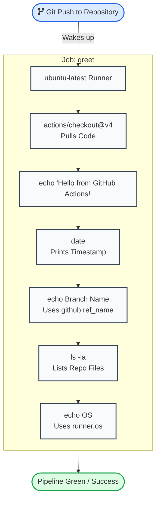

# GitHub Actions Practice 🚀

This repository (`NB11-ML/git-actions`) serves as the practical execution environment for **Day 40** of my `#90DaysProductionReadyDevOpsSREJourney`. It marks the transition from CI/CD theory to writing, deploying, and debugging live automated infrastructure code in the cloud.

For the full theoretical breakdown and documentation, refer to the main journey repository: [Day 40 - First Workflow](https://github.com/NB11-ML/Production-Ready-DevOps-SRE-Journey/blob/0f03d60c1e675cfa1cca3cd39f8337682e589efa/Day-4/01-Day-40-First-Workflow.md).

## 🛠️ Pipeline Architecture (`hello.yml`)

The following Mermaid diagram maps the execution sequence of the foundational CI/CD pipeline triggered in this repository.



## 🧠 Core CI/CD Concepts Applied

This repository practically demonstrates the following GitHub Actions primitives:

* **`on:` (Triggers):** Automating workflow execution on specific repository events (e.g., `[push]`).
* **`jobs:` & `runs-on:` (Runners):** Provisioning isolated virtual machines (like `ubuntu-latest`) to execute deployment instructions.
* **`uses:` (Marketplace Actions):** Leveraging pre-built community actions (`actions/checkout@v4`) to give the runner access to the repository codebase without writing custom shell scripts.
* **`run:` (Shell Execution):** Executing raw terminal commands (`date`, `ls -la`) directly on the runner's operating system.
* **Context Variables:** Dynamically pulling GitHub metadata into the pipeline using syntax like `${{ github.ref_name }}` and `${{ runner.os }}`.

## 💥 Incident Debugging (Task 5)

As part of understanding failure states in SRE pipelines, this repository was used to test intentional non-zero exit codes (e.g., injecting `run: exit 1`).

**Key takeaways from pipeline failures:**

1. Execution halts immediately at the failed step.
2. Subsequent steps are skipped automatically.
3. Failures generate a red 'X' indicator that can be used to block faulty code from being merged into production branches.
4. Standard error (`stderr`) logs can be read directly by expanding the failed step in the GitHub Actions UI.

```

```
