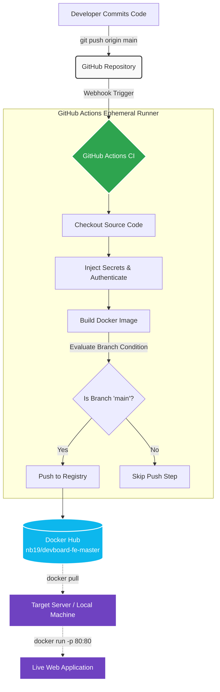

# Day 45: Automated Docker CI/CD Pipeline 🐳

[](https://github.com/NB11-ML/git-actions/actions/workflows/docker-publish.yml)

This repository contains the implementation for **Day 45** of the Production-Ready DevOps & SRE Journey. The primary objective is to architect a production-grade Continuous Integration (CI) pipeline using GitHub Actions to automate Docker image builds and securely push them to Docker Hub.

## 🏗️ End-to-End Pipeline Architecture

The following diagram illustrates the deployment lifecycle, from source code modification to the final running container:



## 📂 Project Structure

```text
.
├── .github/
│   └── workflows/
│       └── docker-publish.yml  # GitHub Actions pipeline configuration
├── Dockerfile                  # Instructions to containerize the Nginx web app
├── index.html                  # Minimal HTML application code
└── day-45-docker-cicd.md       # Detailed technical documentation and runbook
```

## 🚀 How to Run Locally

You can verify the deployment by pulling the live, pipeline-generated image directly from Docker Hub:

**1. Pull the Image:**
```bash
docker pull nb19/devboard-fe-master:latest
```

**2. Run the Container:**
```bash
docker run -d -p 80:80 nb19/devboard-fe-master:latest
```

**3. Verify the Application:**
Open your browser and navigate to `http://localhost` or run:
```bash
curl -i http://localhost
```
You should see: `<h1>Automated Docker CI/CD Pipeline Active 🚀</h1>`

---
*Completed as part of the #90DaysOfDevOps Challenge.*
