# Production-Ready CI/CD Capstone Project

A complete, multi-stage Continuous Integration and Continuous Deployment (CI/CD) pipeline built with GitHub Actions and Docker. This project demonstrates the automated testing, containerization, and protected deployment of a Vite/Node.js frontend application.

## 🏗️ Pipeline Architecture

```mermaid
graph TD
    subgraph Pull Request Workflow
        A[PR Created / Updated] --> B(Reusable: Build & Test)
        B --> C{Tests Pass?}
        C -- Yes --> D[PR Validation Successful]
        C -- No --> E[Block PR Merge]
    end

    subgraph Main Branch CI/CD
        F[Merge to main] --> G(Reusable: Build & Test)
        G --> H(Reusable: Docker Build & Push)
        H --> I{Production Environment}
        I -- Manual Approval Required --> J[CD Deploy to Server/Cluster]
    end

    subgraph Scheduled Health Check
        K((Every 12 Hours)) --> L[Pull Latest Docker Image]
        L --> M[Run Detached Container]
        M --> N{cURL localhost:4173}
        N -- HTTP 200/304 --> O[Generate PASSED Markdown Report]
        N -- Error/Fail --> P[Generate FAILED Markdown Report]
        O --> Q((Cleanup Container))
        P --> Q
    end

```



## 🚀 Key Features

* **Reusable Workflows:** DRY principles applied to GitHub Actions, utilizing `workflow_call` for centralized build, test, and Docker processes.
* **Multi-Stage Containerization:** Dockerfile optimized for a Vite frontend, compiled and served via a lightweight Alpine runtime.
* **Protected Deployments:** Utilizes GitHub Environments to enforce manual reviewer approvals before any code reaches the simulated production environment.
* **Automated Health Monitoring:** A scheduled cron job that pulls the live container, executes an internal health check via cURL, and natively logs the status to the GitHub Actions `$GITHUB_STEP_SUMMARY`.
* **Dependency Conflict Resolution:** Automated bypassing of strict peer dependencies using `--legacy-peer-deps` within the CI runner.

## 🛠️ Technology Stack

* **Frontend:** Vite, React, Node.js (v22)
* **Testing:** Vitest
* **Containerization:** Docker, Docker Hub
* **Automation:** GitHub Actions, Bash/Shell scripting

## 📂 Repository Structure (git-action-project repo)

* `.github/workflows/`
* `pr-pipeline.yml`: PR validation triggers.
* `main-pipeline.yml`: The primary CI/CD lifecycle.
* `reusable-build-test.yml`: Centralized dependency installation and testing.
* `reusable-docker.yml`: Centralized image build and registry push.
* `health-check.yml`: Cron-based container validation.


* `frontend/`: The application source code and multi-stage `Dockerfile`.

```

```
