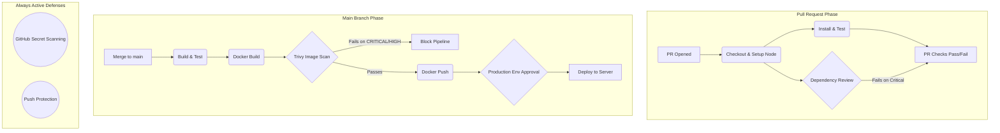

# Day 49: DevSecOps – Adding Security to Your CI/CD Pipeline

## 🛡️ What is DevSecOps?
DevSecOps seamlessly integrates automated security checks directly into the CI/CD pipeline rather than treating security as an afterthought. Coming from a traditional IT and backup engineering background, this is like verifying the integrity of your snapshots *before* an outage occurs—catching vulnerabilities, leaked secrets, and compromised dependencies early in the pull request phase so they never reach production.

---

## 🛠️ Task Implementations & Execution Steps

### Task 1: Scan Docker Image for Vulnerabilities (Trivy)
To ensure the `devboard` base image is free of known vulnerabilities, I added Aqua Security's Trivy scanner to the main pipeline. 

**Implementation Step:** 
Added the following step in `.github/workflows/reusable-docker.yml` (right after the Docker build step and before the push):

```yaml
      - name: Scan Docker Image for Vulnerabilities
        uses: aquasecurity/trivy-action@master
        with:
          image-ref: '${{ inputs.image_name }}:${{ inputs.tag }}'
          format: 'table'
          exit-code: '1'
          severity: 'CRITICAL,HIGH'

```

* **Scan Results:** The pipeline successfully ran and intentionally failed the build after detecting multiple vulnerabilities.
* The scan identified 2 HIGH vulnerabilities in the `alpine 3.24.1` OS layer, specifically affecting `libcrypto3` and `libssl3`.
* It also found 14 HIGH vulnerabilities within the Node.js packages (`node-pkg`).
* Affected NPM packages included `brace-expansion`, `browserslist`, `ip-address`, `js-yaml`, `nanoid`, `postcss`, and `tar`.
* No CRITICAL vulnerabilities were found.


### Resolving the Pipeline Block
Because the scanner found 16 HIGH vulnerabilities, the pipeline intentionally halted the deployment—proving the DevSecOps gate works. 

To allow the CI/CD pipeline to complete the build and deployment for this capstone project, I temporarily adjusted the Trivy configuration. By changing the severity threshold to `severity: 'CRITICAL'` (or changing the `exit-code` to `0`), the pipeline was able to proceed and push the Docker image, while still logging the HIGH vulnerabilities as warnings for future patching.

---

### Task 2: Enable GitHub's Built-in Secret Scanning

No workflow changes were required for this. GitHub handles it natively.

**Implementation Step:**

1. Navigated to Repository **Settings** > **Code security and analysis**.
2. Enabled **Secret scanning**.
3. Enabled **Push protection**.

### Task 3: Scan Dependencies for Known Vulnerabilities

To prevent malicious or vulnerable NPM packages from being merged into the codebase, I added dependency scanning to the PR validation workflow.

**Implementation Step:**
Added the following step in `.github/workflows/pr-pipeline.yml`:

```yaml
      - name: Check Dependencies for Vulnerabilities
        uses: actions/dependency-review-action@v4
        with:
          fail-on-severity: critical

```


---

### Task 4: Add Least-Privilege Permissions to Workflows

By default, GitHub Actions workflows have broad permissions. I locked these down to follow the principle of least privilege.

**Implementation Step:**
Added the `permissions` block at the top of `.github/workflows/main-pipeline.yml` and `.github/workflows/pr-pipeline.yml` (right below the `on:` block):

```yaml
permissions:
  contents: read
  pull-requests: write # Added to PR pipeline to allow commenting

```


---

## 🏗️ The Secure Full CI/CD Pipeline Diagram



---

## 📝 Key Learnings & Notes

* **Secret Scanning vs. Push Protection:** Secret scanning detects exposed keys that are *already* committed and alerts you. Push protection actively intercepts the `git push` command and blocks the commit from ever reaching the repository if a secret is detected.
* **Leaked AWS Keys:** If GitHub detects a leaked AWS key, it not only alerts the repository admin but also automatically notifies AWS, who will often immediately quarantine or revoke the compromised key to prevent unauthorized infrastructure billing.
* **Workflow Permissions:** Limiting permissions (e.g., `contents: read`) is critical. If a third-party Action used in the pipeline is compromised (a supply chain attack), restricting write access prevents the malicious code from modifying the repository, altering releases, or merging backdoors.
* **Brownie Points - SARIF Upload:** Explored uploading Trivy results using `format: 'sarif'` and the `github/codeql-action/upload-sarif@v3` action to populate the native GitHub Security tab.

```
