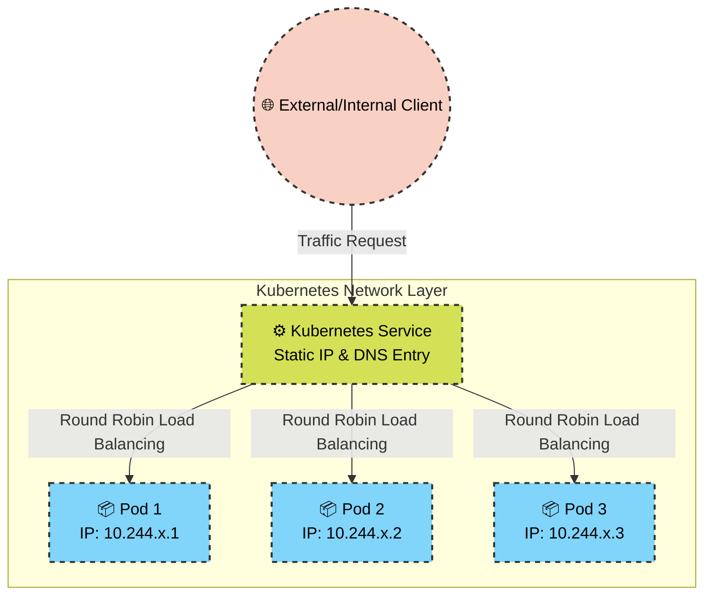

# 🚀 Day 53: Kubernetes Services & The Networking Layer ☸️

Welcome to Day 53 of the **Production-Ready DevOps & SRE Journey**. Yesterday, we achieved high availability using Deployments, but we introduced a critical networking problem: **Ephemeral IP Addresses**. 

Because Deployments constantly destroy and recreate Pods to maintain cluster health, Pod IPs change constantly. If a frontend needs to talk to a backend database, it cannot rely on a hardcoded IP. Today, we solve this utilizing **Kubernetes Services**—the core networking abstraction that provides static identities and native load balancing to dynamic workloads.

---

## 🧠 Core Theory: Why Do We Need Services?

In a traditional VM environment, servers have static IPs. In Kubernetes, Pods are mortal. A Service acts as an immutable anchor for these mortal Pods. It provides two critical functions:
1. **A Static Identity:** A permanent IP address and DNS name (`service.namespace.svc.cluster.local`) that never changes, even if every underlying Pod is replaced.
2. **Transparent Load Balancing:** It automatically intercepts traffic and distributes it evenly (round-robin) across all healthy Pods that match its label selector.

### The 3 Pillars of Kubernetes Networking

*   **ClusterIP (The Default):** Provisions an internal IP address. The application is only accessible from *inside* the cluster. This is the gold standard for backend microservices and databases to prevent unauthorized external access.
*   **NodePort:** Exposes the Service on a static, high-numbered port (`30000-32767`) across the IP address of every physical Worker Node in the cluster. Useful for local testing or direct external access without a cloud provider.
*   **LoadBalancer:** The enterprise standard. It triggers the underlying cloud provider (AWS, GCP, Azure) to provision a physical, external load balancer (like an AWS NLB/ALB) and maps public internet traffic directly into your cluster.

---

## 🏗️ Visualizing Service Architecture

Below is the traffic flow demonstrating how a single Service abstracts away the chaos of ephemeral Pods using endpoint tracking.

---

## 📂 Repository Navigation

| File | Purpose | SRE Context |
| --- | --- | --- |
| [`clusterip-service.yaml`](https://www.google.com/search?q=./clusterip-service.yaml) | Internal Networking | Defines strict internal-only routing for backend security. |
| [`nodeport-service.yaml`](https://www.google.com/search?q=./nodeport-service.yaml) | Node-Level Exposure | Binds the workload to the host machine's network interface. |
| [`loadbalancer-service.yaml`](https://www.google.com/search?q=./loadbalancer-service.yaml) | Cloud Exposure | The declarative blueprint for requesting cloud-native Load Balancers. |
| [`01-Day-53-Services.md`](https://www.google.com/search?q=./01-Day-53-Services.md) | **Execution Runbook** | The complete 7-task operational guide, including CoreDNS discovery testing and endpoint debugging. |
| [`images/`](https://www.google.com/search?q=./images/) | Evidence & Screenshots | Contains proof of successful DNS resolution (`nslookup`) and endpoint mapping. |

## ⚠️ Critical SRE Takeaway: Selectors & Endpoints

A Service is entirely blind without its **Selector**. The Service continuously scans the cluster for Pods with labels matching its selector (e.g., `app: nginx`). When it finds a match, it adds the Pod's ephemeral IP to an **Endpoints** list. If a Service is actively refusing connections, an SRE's first instinct is always to run `kubectl get endpoints <service-name>`—if the list is empty, the YAML labels are mismatched!
