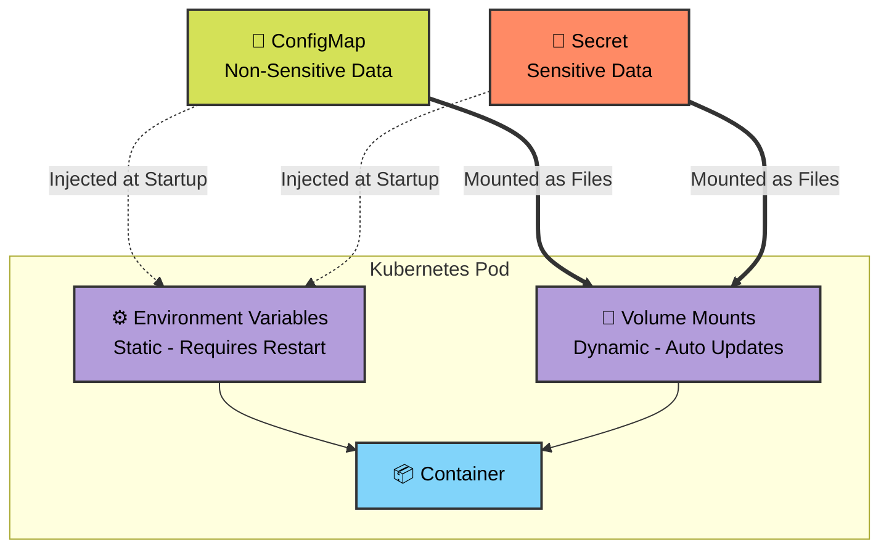

# 🚀 Day 54: Kubernetes ConfigMaps and Secrets 🔐


Welcome to Day 54 of the **Production-Ready DevOps & SRE Journey**. Hardcoding configurations (like database URLs or API keys) directly into container images is an anti-pattern. It forces you to rebuild the entire image just to change a single port number. 

Today, we decouple our configuration from our application code using **ConfigMaps** (for non-sensitive data) and **Secrets** (for sensitive data).

---

## 🧠 Core Theory: Documentation & SRE Best Practices

### 1. ConfigMaps vs. Secrets
*   **ConfigMaps:** Used for non-confidential data (e.g., `APP_ENV=production`, Nginx config files, feature flags). Stored in plain text.
*   **Secrets:** Used for sensitive data (e.g., Passwords, API Keys, TLS Certificates). Stored securely using Base64 encoding.

### 2. Base64 is NOT Encryption
When you inspect a Secret, the values look scrambled (e.g., `YWRtaW4=`). **This is just Base64 encoding, not encryption.** Anyone with `kubectl` access to the namespace can decode it instantly. The true security of Kubernetes Secrets comes from:
*   **RBAC (Role-Based Access Control):** Restricting *who* can query Secrets.
*   **tmpfs Storage:** Secrets are never written to physical disk on the Worker Nodes; they exist purely in memory (RAM).
*   **Encryption at Rest:** A cluster-level setting (KMS) that encrypts the etcd database where Secrets are actually stored.

### 3. Environment Variables vs. Volume Mounts (The Propagation Rule)
*   **Environment Variables (`envFrom`):** Injected exactly once when the Pod starts. If you update the ConfigMap/Secret later, the Pod **will not** see the changes until it is manually restarted. Perfect for static flags.
*   **Volume Mounts:** Mounted directly into the container's file system as physical files. Kubernetes runs a background sync (kubelet). If you update the ConfigMap/Secret, the file inside the container **updates automatically** (usually within 30-60 seconds) without requiring a Pod restart!

---

## 🏗️ Visualizing Config Injection Architecture



---

## 🛠️ Execution Runbook

### Task 1: Create a ConfigMap from Literals

We will create a standard application configuration using literal command-line values.

```bash
# Create the ConfigMap
kubectl create configmap app-config \
  --from-literal=APP_ENV=production \
  --from-literal=APP_DEBUG=false \
  --from-literal=APP_PORT=8080

# Inspect the ConfigMap to see plain-text storage
kubectl get configmap app-config -o yaml
kubectl describe configmap app-config

```


**Verification:** You will clearly see all three key-value pairs entirely unencrypted in the YAML output.

---

### Task 2: Create a ConfigMap from a File

SREs frequently inject entire configuration files (like `nginx.conf` or `prometheus.yml`) directly into containers.

**1. Create a local file named `default.conf`:**

```bash
cat <<EOF> default.conf
server {
    listen 80;
    location /health {
        add_header Content-Type text/plain;
        return 200 'healthy\n';
    }
}
EOF

```

**2. Convert the file into a ConfigMap:**

```bash
kubectl create configmap nginx-config --from-file=default.conf=default.conf

```


**Verification:** Run `kubectl get configmap nginx-config -o yaml`. You will see the entire file contents mapped to the key `default.conf`.

---

### Task 3: Use ConfigMaps in a Pod

**1. Test Environment Variable Injection:**
Save as `env-pod.yaml` and apply (`kubectl apply -f env-pod.yaml`).

```yaml
apiVersion: v1
kind: Pod
metadata:
  name: config-env-pod
spec:
  containers:
  - name: busybox
    image: busybox:latest
    command: ["/bin/sh", "-c", "env | grep APP_ && sleep 3600"]
    envFrom:
    - configMapRef:
        name: app-config

```

*Check logs:* `kubectl logs config-env-pod` will output your `APP_ENV`, `APP_DEBUG`, and `APP_PORT`.


**2. Test Volume Mount Injection:**
Save as `vol-pod.yaml` and apply.

```yaml
apiVersion: v1
kind: Pod
metadata:
  name: nginx-config-pod
spec:
  containers:
  - name: nginx
    image: nginx:alpine
    volumeMounts:
    - name: config-volume
      mountPath: /etc/nginx/conf.d
  volumes:
  - name: config-volume
    configMap:
      name: nginx-config

```

*Test the mount:* `kubectl exec nginx-config-pod -- curl -s http://localhost/health`


**Verification:** It will return `healthy`, proving Nginx loaded the ConfigMap as a physical file!

---

### Task 4: Create a Secret

We will store database credentials securely using generic secrets.

```bash
# Create the Secret
kubectl create secret generic db-credentials \
  --from-literal=DB_USER=admin \
  --from-literal=DB_PASSWORD=s3cureP@ssw0rd

# View the Base64 encoded values
kubectl get secret db-credentials -o yaml

# Decode the password to prove it is not encrypted
kubectl get secret db-credentials -o jsonpath='{.data.DB_PASSWORD}' | base64 --decode

```


---

### Task 5: Use Secrets in a Pod

We will mix both methods: injecting the username as an environment variable, and mounting the whole secret as files.

Save as `secret-pod.yaml` and apply.

```yaml
apiVersion: v1
kind: Pod
metadata:
  name: secret-test-pod
spec:
  containers:
  - name: busybox
    image: busybox:latest
    command: ["/bin/sh", "-c", "sleep 3600"]
    env:
    - name: DB_USER_ENV
      valueFrom:
        secretKeyRef:
          name: db-credentials
          key: DB_USER
    volumeMounts:
    - name: secret-volume
      mountPath: /etc/db-credentials
      readOnly: true
  volumes:
  - name: secret-volume
    secret:
      secretName: db-credentials

```

**Verification:**


* Check env var: `kubectl exec secret-test-pod -- env | grep DB_USER`
* Check file contents: `kubectl exec secret-test-pod -- cat /etc/db-credentials/DB_PASSWORD` (Notice it outputs the **plaintext** password, not base64!).

---

### Task 6: Update a ConfigMap and Observe Propagation

This demonstrates why volume mounts are powerful for dynamic configurations.

**1. Create a live ConfigMap and Pod:**

```bash
kubectl create configmap live-config --from-literal=message=hello

```

Save as `live-pod.yaml` and apply.

```yaml
apiVersion: v1
kind: Pod
metadata:
  name: live-update-pod
spec:
  containers:
  - name: busybox
    image: busybox:latest
    command: ["/bin/sh", "-c", "while true; do cat /etc/config/message; echo ''; sleep 5; done"]
    volumeMounts:
    - name: config-vol
      mountPath: /etc/config
  volumes:
  - name: config-vol
    configMap:
      name: live-config

```

**2. Watch the logs in terminal 1:**

```bash
kubectl logs -f live-update-pod

```


**3. Patch the ConfigMap in terminal 2:**

```bash
kubectl patch configmap live-config --type merge -p '{"data":{"message":"world"}}'

```


**Verification:** Wait 30-60 seconds. The logs in terminal 1 will magically switch from "hello" to "world" without you ever restarting the Pod! Kubelet automatically synced the volume file.

---

### Task 7: Clean Up

Maintain a clean cluster by removing the day's resources.

```bash
kubectl delete pod config-env-pod nginx-config-pod secret-test-pod live-update-pod
kubectl delete configmap app-config nginx-config live-config
kubectl delete secret db-credentials
rm default.conf env-pod.yaml vol-pod.yaml secret-pod.yaml live-pod.yaml
```
```
