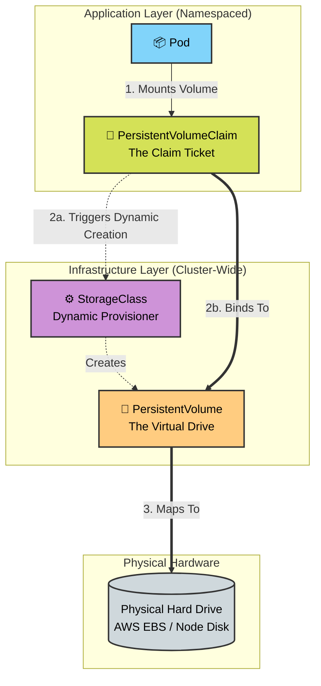

# 🚀 Day 55: Mastering Kubernetes Stateful Storage (PV & PVC) 💾


Welcome to Day 55 of the **Production-Ready DevOps & SRE Journey**. 

Today, we are solving one of the most critical architectural challenges in cloud-native engineering: **Data Persistence.**

Containers are ephemeral by design. When a Pod crashes, scales down, or is rescheduled to a new node, its local file system is wiped completely clean. While this is perfect for stateless web servers, it is a catastrophic disaster for databases (like PostgreSQL or MongoDB) that require data to survive a restart. 

In this module, we successfully decouple the storage lifecycle from the compute lifecycle using Kubernetes **Persistent Volumes (PV)** and **Persistent Volume Claims (PVC)**.

---

## 📖 The SRE Storage Syllabus

### 🏗️ Kubernetes Storage Architecture


### 1. The Ephemeral Danger (`emptyDir`)
We begin by proving the danger of standard container storage. By deploying a Pod with an `emptyDir` volume, we demonstrate that while data can be written, a simple Pod deletion results in total and permanent data loss.

### 2. Static Provisioning (The Manual Hard Drive)
We act as the Cluster Administrator to physically carve out a chunk of storage. 
*   **Persistent Volume (PV):** A cluster-wide storage resource (the actual hard drive).
*   **Persistent Volume Claim (PVC):** A namespaced request ticket from a developer asking for a specific amount of that storage. 

### 3. Dynamic Provisioning (The Cloud Standard)
Manual provisioning does not scale in an enterprise environment. We configure a `StorageClass` to intercept PVC requests and automatically provision the underlying physical disks on the fly. 
*   **SRE Trap Avoided:** We explore the `WaitForFirstConsumer` volume binding mode, which intentionally keeps claims in a `Pending` state until a Pod actually requests the storage, ensuring the disk is created in the correct Availability Zone!

### 4. Reclaim Policies (The Safety Nets)
What happens to the physical hard drive when a developer deletes their claim ticket?
*   **Retain:** The data is kept safe on the disk, requiring manual administrator intervention to wipe or recover. (Crucial for preventing accidental database deletion).
*   **Delete:** The underlying cloud storage is instantly and permanently destroyed. (Standard for dynamic provisioning).

---

## 📂 Repository Directory Map

All detailed line-by-line SRE breakdowns and YAML manifests for today's tasks are documented in the `manifest/` directory.

## 📂 Repository Directory Map

```text
Day-55/
├── README.md                           # Master syllabus and architecture guide
├── day-55-persistent-volumes.md        # Core challenge documentation and theory
├── day-55-cheatsheet.md                # Quick-reference commands and SRE troubleshooting
└── manifest/                           # YAML files and line-by-line SRE runbooks
    ├── ephemeral-pod.yaml              # Task 1: Proving emptyDir data loss
    ├── manual-pv.yaml                  # Task 2: Static PV creation
    ├── manual-pv-desc.md          
    ├── manual-pvc.yaml                 # Task 3: Static PVC claim
    ├── manual-pvc-desc.md         
    ├── pvc-pod.yaml                    # Task 4: Mounting static PVC to a Pod
    ├── pvc-pod-desc.md            
    ├── dynamic-pvc.yaml                # Task 6: Dynamic PVC claim
    ├── dynamic-pvc-desc.md        
    ├── dynamic-pod.yaml                # Task 6: Consumer Pod for dynamic storage
    └── dynamic-pod-desc.md
```
---

### 👨‍🏫 Final Takeaway
By mastering PVs and PVCs, you have bridged the gap between stateless compute and stateful reliability. Your applications can now survive catastrophic node failures without losing a single byte of customer data! 

*Next up: Pushing deeper into advanced Kubernetes deployments and network routing.*
