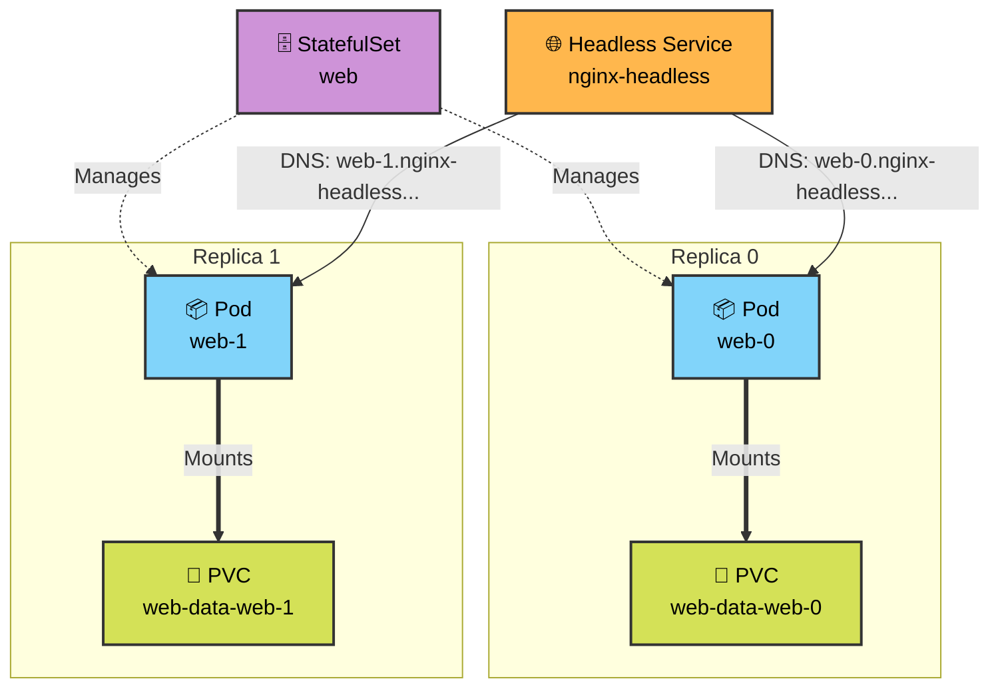

# 🗄️ Day 56: Mastering Kubernetes StatefulSets 


Welcome to Day 56 of the **Production-Ready DevOps & SRE Journey**. 

Yesterday, we decoupled storage from compute using Persistent Volumes. Today, we solve the second half of the database puzzle: **Network Identity and Ordered Execution**.

While Kubernetes `Deployments` are the gold standard for stateless applications (like web servers), their randomized naming conventions and parallel scaling make them incredibly dangerous for stateful applications (like MySQL, PostgreSQL, or Kafka clusters). 

In this module, we implement `StatefulSets` and `Headless Services` to give our workloads predictable names, stable DNS routing, and guaranteed startup ordering.

---

## 📖 The SRE Stateful Syllabus

### 1. The Deployment Trap
We begin by proving why Deployments fail at stateful workloads. We observe how randomized Pod names (`web-7df6c...`) and randomized IP addresses make it impossible for a database replica to reliably sync with a primary node after a crash.

### 2. Headless Services (`ClusterIP: None`)
Standard Services load-balance traffic across multiple Pods. We create a "Headless" Service to bypass this behavior, forcing Kubernetes to create an individual, predictable DNS record for every single replica in our cluster.

### 3. StatefulSets & Dynamic Provisioning
We replace the Deployment with a StatefulSet. 
*   **Ordered Identity:** Replicas are created sequentially (`web-0`, `web-1`, `web-2`).
*   **`volumeClaimTemplates`:** We eliminate manual PVC creation by allowing the StatefulSet to automatically generate and bind a unique hard drive for every individual Pod.

### 4. Disaster Recovery & Scaling Operations
We simulate catastrophic Pod failure (`web-0`) to prove that the StatefulSet instantly recreates the Pod with its exact same identity and reconnects it to its exact same physical storage. We also execute ordered scale-up and scale-down operations, verifying that scaling down safely preserves the underlying data.

---

### 🏗️ Stateful Network Architecture



---

## 📂 Repository Directory Map

```text
Day-56/
├── README.md                      # The master syllabus and architecture guide
├── 01-Day-56-Statefulsets.md      # Core challenge documentation, theory, and execution steps
├── 02-Day-56-Cheat-Sheet.md       # Quick-reference commands and SRE interview prep
└── manifest/                      # YAML manifests for the stateful database architecture
    ├── headless-svc.yaml          # Task 2: Stable network identity configuration
    └── statefulset.yaml           # Task 3: Stateful workload with dynamic PVC templates

```

---

### 👨‍🏫 Final Takeaway

By combining `StatefulSets`, `volumeClaimTemplates`, and `Headless Services`, you have successfully built the foundational infrastructure required to run enterprise-grade, highly available database clusters directly inside Kubernetes.

---
