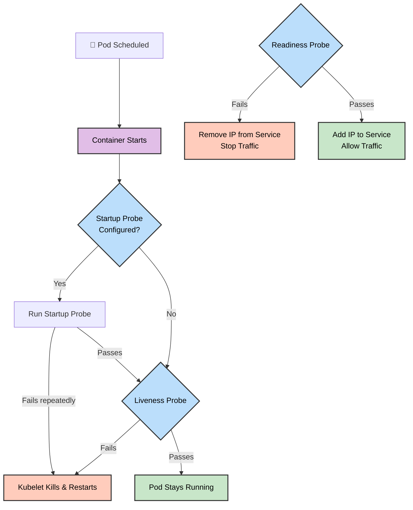

# 🚦 Day 57: Kubernetes Resources, Limits & Probes


Welcome to Day 57 of the **Production-Ready DevOps & SRE Journey**.

Deploying applications into a Kubernetes cluster is only the first step. Operating them safely in a multi-tenant environment requires strict boundaries. Without **Resource Constraints**, a single memory-leaking Pod can consume an entire Node and crash critical infrastructure (the "Noisy Neighbor" problem). Without **Health Probes**, Kubernetes cannot distinguish between a healthy application and a deadlocked process.

Today, we implement the core SRE guardrails required to keep a production cluster stable, predictable, and self-healing.

---

## 📖 The SRE Syllabus

### 1. Resource Scheduling & Enforcement (QoS)
We configure `requests` (the guaranteed minimum hardware used by the Scheduler for placement) and `limits` (the absolute maximum hardware enforced by the Kubelet). We analyze how Kubernetes assigns Quality of Service (QoS) classes—`BestEffort`, `Burstable`, and `Guaranteed`—to prioritize which Pods survive when a Node runs out of memory.

### 2. OOMKilled Diagnostics (Exit Code 137)
We deploy a stress-testing container that intentionally attempts to allocate more RAM than its defined limit. We observe the Linux kernel stepping in to ruthlessly terminate the process, yielding the classic `OOMKilled` state. We also simulate a `Pending` state by requesting more hardware than any single Node possesses.

### 3. Automated Self-Healing (Probes)
We implement the three pillars of Kubernetes health checking:
*   **Startup Probes:** Protecting slow-booting legacy applications from being prematurely killed by aggressive health checks. 
*   **Liveness Probes:** Detecting when an application is stuck or deadlocked, automatically triggering a container restart to recover it.
*   **Readiness Probes:** Controlling live web traffic. If an app becomes temporarily overwhelmed, this probe silently removes the Pod's IP from the Service Endpoints without killing the container.

---

### 🏗️ Pod Lifecycle & Probe Architecture



---

## 📂 Repository Directory Map

```text
Day-57/
├── README.md                      # The master syllabus and lifecycle architecture
├── 01-Day-57-Resources-Probes.md  # Core challenge documentation, theory, and execution
├── 02-Day-57-Cheat-Sheet.md       # Quick-reference commands and SRE interview prep
└── manifest/                      # YAML manifests for resources and probes
    ├── resources-pod.yaml         # Task 1: CPU/Mem requests and burstable limits
    ├── oom-pod.yaml               # Task 2: Exceeding limits (OOMKilled 137)
    ├── huge-request-pod.yaml      # Task 3: Pending pod (FailedScheduling)
    ├── liveness-pod.yaml          # Task 4: Self-healing a deadlocked container
    ├── readiness-pod.yaml         # Task 5: Traffic control via Service endpoints
    └── startup-pod.yaml           # Task 6: Slow boot protection threshold testing

```

---

### 👨‍🏫 Final Takeaway

By strictly defining Resource Limits and configuring intelligent Health Probes, you shift Kubernetes from a basic container orchestrator into an automated, highly-resilient, and self-healing platform.
