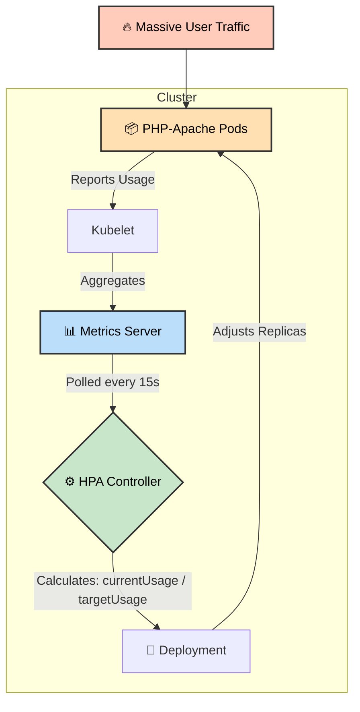

# 📈 Day 58: Metrics Server & Horizontal Pod Autoscaler (HPA)


Welcome to Day 58 of the **Production-Ready DevOps & SRE Journey**.

Yesterday, we established strict boundaries using static Resource Requests and Limits. However, production traffic is rarely static. If you over-provision replicas, you waste infrastructure budget. If you under-provision, your application crashes under load.

Today, we implement dynamic scaling using the **Horizontal Pod Autoscaler (HPA)**. By integrating the **Metrics Server**, we enable Kubernetes to observe real-time CPU utilization and automatically scale our application up during traffic spikes and down during quiet periods.

---

## 📖 The SRE Syllabus

### 1. Observability (Metrics Server)
Kubernetes cannot scale what it cannot measure. We deployed the cluster-wide Metrics Server and patched it with `--kubelet-insecure-tls` to bypass local VM certificate blocks. We utilized `kubectl top nodes` and `kubectl top pods` to view real-time resource consumption instead of static configurations.

### 2. The Golden Rule of HPA
HPA relies mathematically on a baseline to calculate percentages. We demonstrated why a Pod **must** have `resources.requests.cpu` defined in its Deployment manifest. Without it, the HPA TARGETS column returns `<unknown>` and autoscaling fails.

### 3. Imperative vs. Declarative Scaling
*   **autoscaling/v1 (Imperative):** We simulated a traffic spike using a `busybox` `wget` loop, watching the HPA reactively scale our deployment from 1 to 10 replicas.
*   **autoscaling/v2 (Declarative):** We graduated to the modern SRE standard, writing YAML manifests to define strict `behavior` policies. We configured the HPA to scale UP instantly (0s stabilization window) to protect the app, but scale DOWN slowly (300s stabilization window) to prevent thrashing.

---

### 🏗️ HPA Control Loop Architecture



---

## 📂 Repository Directory Map

Based on our established structure, here is the directory layout for Day 58:

```text
Day-58/
├── manifest/
│   ├── hpa-v2.yaml                  # Declarative HPA with custom scaling behaviors
│   └── php-apache.yaml              # Target deployment with CPU requests configured
├── 01-Day-58-Metrics-HPA.md         # Core challenge documentation, theory, and execution
├── 02-Day-58-Cheat-Sheet.md         # Quick-reference commands and HPA troubleshooting
└── README.md                        # The master syllabus and control loop architecture

```

---

### 👨‍🏫 Final Takeaway

By combining Resource Requests with the Horizontal Pod Autoscaler, you transform Kubernetes into an elastic platform that automatically balances high availability with cost efficiency.
