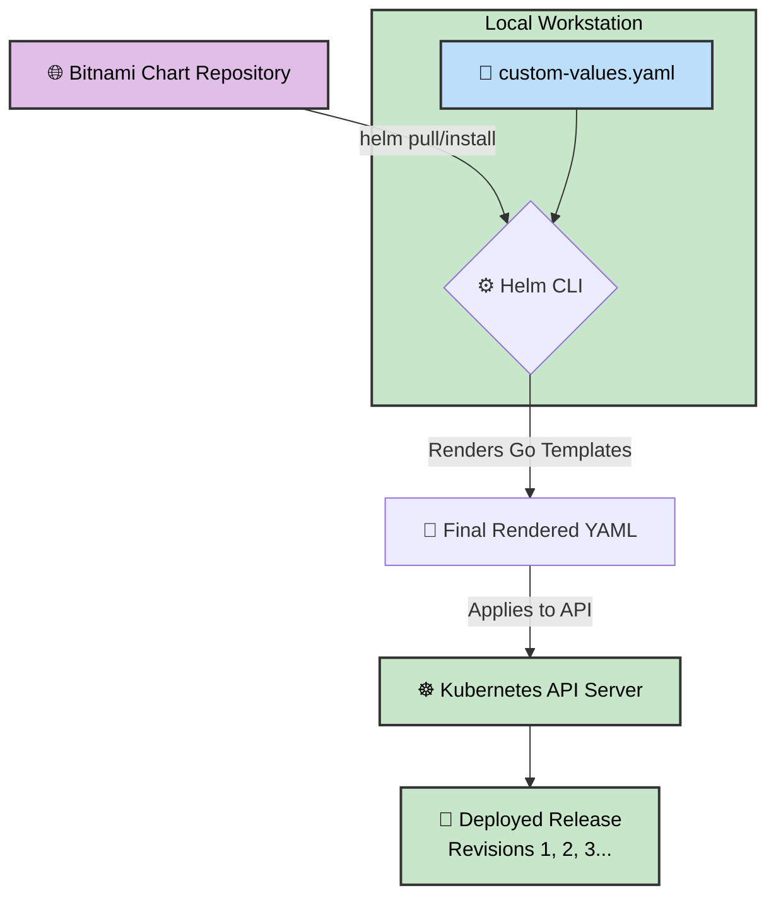

# 📦 Day 59: Helm — The Kubernetes Package Manager


Welcome to Day 59 of the **Production-Ready DevOps & SRE Journey**.

Over the past few weeks, we have written dozens of Kubernetes manifests by hand. While raw YAML is great for learning, maintaining hundreds of distinct files across multiple environments (Dev, Staging, Prod) quickly leads to "manifest sprawl" and configuration drift. 

Today, we graduate to **Helm**. Just like `apt` for Ubuntu, Helm allows us to template, install, upgrade, and safely rollback entire application stacks with a single command, keeping our repository clean and our infrastructure DRY (Don't Repeat Yourself).

---

## 📖 The SRE Syllabus

### 1. The Helm Trinity
We explored the three foundational pillars of Kubernetes package management:
*   **Chart:** The Go-templated blueprint containing the application's Kubernetes YAML structure.
*   **Repository:** A centralized, version-controlled server hosting packaged Charts (we utilized the enterprise-grade **Bitnami** repository).
*   **Release:** A specific, running instance of a Chart deployed into our cluster.

### 2. Custom Values & Configuration Drift
Instead of hardcoding values into YAML manifests, we utilized a `custom-values.yaml` file to dynamically inject infrastructure requirements (like specific NodePorts and CPU/Memory limits) into the Chart at runtime. We also debugged a real-world configuration drift issue caused by YAML's strict case-sensitivity requirements.

### 3. Immutable Rollbacks
We proved that Helm maintains a completely immutable deployment history. When an upgrade failed or needed to be reverted, `helm rollback` did not simply delete the intermediate steps. Instead, it created a brand new revision mirroring the known-good state, preserving the SRE audit trail.

---

### 🏗️ Helm Architecture & Deployment Flow



---

## 📂 Repository Directory Map

*Note: Because Helm abstractly manages the Kubernetes YAML via charts and repositories, there is no hardcoded `manifest/` folder for today's module. All configurations are handled dynamically!*

```text
Day-59/
├── README.md                      # The master syllabus and Helm architecture
├── 01-Day-59-Helm.md              # Core challenge documentation, theory, and execution
└── 02-Day-59-Cheat-Sheet.md       # Quick-reference commands and SRE interview prep

```

---

### 👨‍🏫 Final Takeaway

Helm transforms Kubernetes from a platform where you manually push files into a platform where you manage version-controlled software releases. It is an absolute requirement for scalable Site Reliability Engineering.
---
