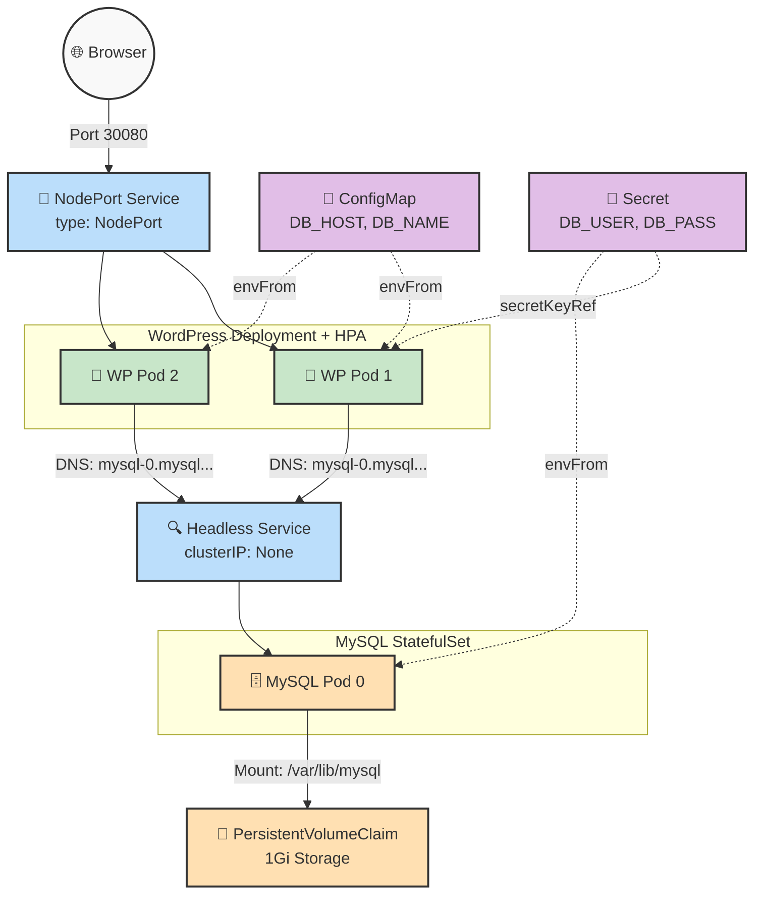

# 🎓 Day 60 Capstone: Deploying a Production-Ready WordPress & MySQL Stack


Welcome to Day 60 of the **Production-Ready DevOps & SRE Journey**. 

Over the past ten days, we have systematically broken down Kubernetes into its core SRE components: Pod lifecycle, Replica control, Networking, Configuration management, Stateful persistence, Resource boundaries, Autoscaling, and Package management. 

Today is the Capstone. We are synthesizing every single concept into one monolithic deployment: a highly available, self-healing, auto-scaling, and persistent WordPress application backed by a MySQL database.

---

## 🏗️ Capstone Architecture



---

## 🚀 Execution Guide & Tasks

### Task 1: Environment Isolation (Namespaces)

Best practice dictates we isolate this capstone from our default cluster resources.

```bash
kubectl create namespace capstone
kubectl config set-context --current --namespace=capstone

```


---

### Task 2: Deploy MySQL (Stateful, Secret, Headless Svc)

We deploy the database using a StatefulSet and a Headless Service to ensure stable network identity (`mysql-0.mysql.capstone.svc.cluster.local`) and strict data persistence.

**1. Create `01-mysql.yaml`:**

```yaml
apiVersion: v1
kind: Secret
metadata:
  name: mysql-secret
stringData:
  MYSQL_ROOT_PASSWORD: supersecretroot
  MYSQL_DATABASE: wordpress
  MYSQL_USER: wp_user
  MYSQL_PASSWORD: wp_password
---
apiVersion: v1
kind: Service
metadata:
  name: mysql
spec:
  ports:
  - port: 3306
  clusterIP: None # Headless Service
  selector:
    app: mysql
---
apiVersion: apps/v1
kind: StatefulSet
metadata:
  name: mysql
spec:
  selector:
    matchLabels:
      app: mysql
  serviceName: "mysql"
  replicas: 1
  template:
    metadata:
      labels:
        app: mysql
    spec:
      containers:
      - name: mysql
        image: mysql:8.0
        envFrom:
        - secretRef:
            name: mysql-secret
        ports:
        - containerPort: 3306
        resources:
          requests:
            cpu: 250m
            memory: 512Mi
          limits:
            cpu: 500m
            memory: 1Gi
        volumeMounts:
        - name: mysql-persistent-storage
          mountPath: /var/lib/mysql
  volumeClaimTemplates:
  - metadata:
      name: mysql-persistent-storage
    spec:
      accessModes: [ "ReadWriteOnce" ]
      resources:
        requests:
          storage: 1Gi

```

**2. Apply and Verify:**

```bash
kubectl apply -f 01-mysql.yaml
kubectl get pods -w  # Wait for mysql-0 to be Running
kubectl exec -it mysql-0 -- mysql -u wp_user -pwp_password -e "SHOW DATABASES;"

```


> **✅ Verify:** *Can you see the wordpress database?*
---

### Task 3 & 4: Deploy and Expose WordPress (Deploy, ConfigMap, Probes, NodePort)

We deploy WordPress statelessly, connecting it to our MySQL database using DNS resolution, and expose it to the outside world.

**1. Create `02-wordpress.yaml`:**

```yaml
apiVersion: v1
kind: ConfigMap
metadata:
  name: wp-config
data:
  WORDPRESS_DB_HOST: mysql-0.mysql.capstone.svc.cluster.local:3306
  WORDPRESS_DB_NAME: wordpress
---
apiVersion: apps/v1
kind: Deployment
metadata:
  name: wordpress
spec:
  replicas: 2
  selector:
    matchLabels:
      app: wordpress
  template:
    metadata:
      labels:
        app: wordpress
    spec:
      containers:
      - name: wordpress
        image: wordpress:latest
        envFrom:
        - configMapRef:
            name: wp-config
        env:
        - name: WORDPRESS_DB_USER
          valueFrom:
            secretKeyRef:
              name: mysql-secret
              key: MYSQL_USER
        - name: WORDPRESS_DB_PASSWORD
          valueFrom:
            secretKeyRef:
              name: mysql-secret
              key: MYSQL_PASSWORD
        ports:
        - containerPort: 80
        resources:
          requests:
            cpu: 250m
            memory: 256Mi
          limits:
            cpu: 500m
            memory: 512Mi
        livenessProbe:
          httpGet:
            path: /wp-login.php
            port: 80
          initialDelaySeconds: 30
          periodSeconds: 10
        readinessProbe:
          httpGet:
            path: /wp-login.php
            port: 80
          initialDelaySeconds: 30
          periodSeconds: 10
---
apiVersion: v1
kind: Service
metadata:
  name: wordpress
spec:
  type: NodePort
  ports:
  - port: 80
    nodePort: 30080
  selector:
    app: wordpress

```

**2. Apply and Verify:**
```bash
kubectl apply -f 02-wordpress.yaml
kubectl get pods -w

```

*(Once both pods are running, create a secure API tunnel bypassing the VM network by running `kubectl port-forward svc/wordpress 8080:80 -n capstone --address 0.0.0.0`. Then, open your physical machine's browser and access the site at `http://localhost:8080`. Complete the setup wizard and write a test blog post!)*


> **✅ Verify:** *Are both WordPress pods running and ready? Can you see the WordPress setup page?*
> **Answer:** *(Confirm here once you have set up the admin account and created a post!)*


---

### Task 5: SRE Chaos Testing (Self-Healing & Persistence)

Let's prove our infrastructure is indestructible.

**1. Kill a stateless frontend pod:**

```bash
kubectl delete pod -l app=wordpress
# Watch the deployment immediately spin up replacements.

```

**2. Kill the stateful database pod:**

```bash
kubectl delete pod mysql-0
# The StatefulSet will recreate mysql-0 and automatically re-attach the PVC.

```


> **✅ Verify:** *After deleting both pods, is your blog post still there?*
> **Answer:** *(Refresh your browser. State whether the post survived the database pod deletion!)*


---

### Task 6: Implement Autoscaling (HPA)

Ensure the WordPress frontend can handle sudden viral traffic.

**1. Create `03-hpa.yaml`:**

```yaml
apiVersion: autoscaling/v2
kind: HorizontalPodAutoscaler
metadata:
  name: wordpress-hpa
spec:
  scaleTargetRef:
    apiVersion: apps/v1
    kind: Deployment
    name: wordpress
  minReplicas: 2
  maxReplicas: 10
  metrics:
  - type: Resource
    resource:
      name: cpu
      target:
        type: Utilization
        averageUtilization: 50

```

**2. Apply and Verify:**

```bash
kubectl apply -f 03-hpa.yaml
kubectl get hpa

```


> **✅ Verify:** *Does the HPA show correct min/max and target?*
> **Answer:** *(Paste the output of `kubectl get hpa` here)*

---

### Task 7: Bonus - The Helm Comparison

To deploy this exact stack using Helm requires one command:

```bash
helm install wp-helm bitnami/wordpress --namespace helm-test --create-namespace

```


**Comparison:** While Helm deployed the stack in seconds and created ~15 resources automatically, building it manually gave us total granular control over our specific StatefulSet DNS names, exact resource allocations, and custom probe timings. SREs must know how to build from scratch before they can safely automate with Helm.

---

### Task 8: Cleanup & SRE Reflection

Take your final screenshot of `kubectl get all -n capstone` before destroying the environment!

```bash
kubectl delete namespace capstone
kubectl config set-context --current --namespace=default

```

> **✅ Verify:** *Did deleting the namespace remove everything?*
> **Answer:** Yes, deleting a namespace instantly garbage-collects all Deployments, StatefulSets, Services, Secrets, and HPAs inside it, effectively destroying the entire stack cleanly.

---

## 📚 Concept Mapping Table

| Kubernetes Concept | SRE Use Case in this Capstone | Learned On |
| --- | --- | --- |
| **Namespace** | Isolated the Capstone environment from other cluster workloads. | Day 52 |
| **Deployment** | Managed the stateless WordPress frontend replicas and self-healing. | Day 52 |
| **NodePort Service** | Exposed the WordPress pods to external web traffic. | Day 53 |
| **Secret / ConfigMap** | Decoupled DB passwords and host configs from the pod image. | Day 54 |
| **PersistentVolumeClaim (PVC)** | Ensured MySQL data survived pod restarts and crashes. | Day 55 |
| **StatefulSet** | Provided MySQL with ordered deployment and stable network identity. | Day 56 |
| **Headless Service** | Created the direct internal DNS entry (`mysql-0.mysql...`) for WP to connect to. | Day 56 |
| **Resource Limits & Probes** | Prevented OOM crashes and ensured WP was actually ready for traffic. | Day 57 |
| **Horizontal Pod Autoscaler** | Enabled dynamic scaling for viral traffic spikes based on CPU. | Day 58 |

## 🧠 SRE Reflection

* **What was hardest:** Aligning the DNS resolution (`mysql-0.mysql.capstone.svc.cluster.local`). StatefulSet networking requires absolute precision between the Headless Service name and the Pod index.
* **What clicked:** The separation of state. Proving that deleting the database pod (`mysql-0`) didn't destroy data because the PVC acted as an independent hard drive that just re-attached to the newly scheduled pod.
* **What I would add for Production:** I would upgrade the NodePort to an Ingress Controller with TLS certificates for secure HTTPS routing, and migrate the MySQL database to a managed cloud service (like AWS RDS) rather than running it inside the cluster, to offload backup and recovery responsibilities.
