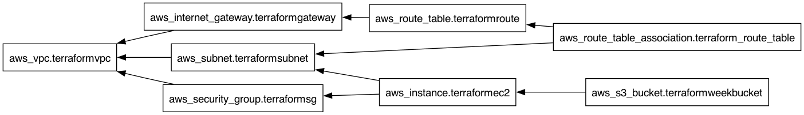

#  Day 62: Providers, Resources, and Dependencies


Welcome to Day 62 of the **Production-Ready DevOps & SRE Journey**! 

Yesterday we provisioned standalone resources. Today, we elevated our Infrastructure as Code (IaC) skills by building a fully interconnected cloud networking stack on AWS. The core focus of this module is mastering how Terraform resolves relationships between resources using the Directed Acyclic Graph (DAG).

---

## 📖 The SRE Syllabus

### 1. The AWS Provider & Version Locking
We explored the `required_providers` block, understanding the difference between pessimistic (`~> 5.0`) and absolute version constraints. We also analyzed the `.terraform.lock.hcl` file, a critical component for ensuring idempotent infrastructure deployments across different engineering teams.

### 2. Building a Custom VPC Architecture
We completely bypassed the default AWS network and hardcoded a custom environment from scratch:
*   `aws_vpc` (CIDR `10.0.0.0/16`)
*   `aws_subnet` (Public Subnet in `us-east-1a`)
*   `aws_internet_gateway` & `aws_route_table` (Configuring `0.0.0.0/0` access)
*   `aws_security_group` (TCP 80 and TCP 22 ingress)
*   `aws_instance` (Public-facing Web Server)

### 3. Implicit vs. Explicit Dependencies

 

Understanding dependencies separates Terraform beginners from production engineers:
*   **Implicit Dependencies:** Terraform automatically sequences creation based on attribute references (e.g., the Subnet cannot exist without the `aws_vpc.id`).
*   **Explicit Dependencies:** We utilized the `depends_on = []` meta-argument to force an S3 bucket to wait for the EC2 instance to finish provisioning, completely overriding Terraform's default concurrent creation behavior.

### 4. Lifecycle Rules
We explored how to safely update or protect production resources using `create_before_destroy`, `prevent_destroy`, and `ignore_changes` lifecycle blocks.

---

## 📂 Repository Directory Map

```text
Day-62/
├── README.md                              # The master syllabus and directory map
├── 01-Day-62-Providers-Resources.md       # Core challenge documentation[cite: 14]
├── 02-Day-62-Cheat-Sheet.md               # Quick reference guide and interview prep
└── files/                                 # Terraform configurations and visuals[cite: 14]
    ├── main.tf                            # HCL code for the AWS network stack[cite: 13]
    ├── providers.tf                       # AWS provider configuration[cite: 13]
    └── graph.png                          # Generated DAG visual[cite: 13]

```

---

### 👨‍🏫 Final Takeaway

Real infrastructure is highly connected. By trusting Terraform's graph execution—and knowing how to manipulate it with explicit dependencies and lifecycle blocks—we can safely orchestrate hundreds of AWS resources in a single `terraform apply` with zero manual intervention.
