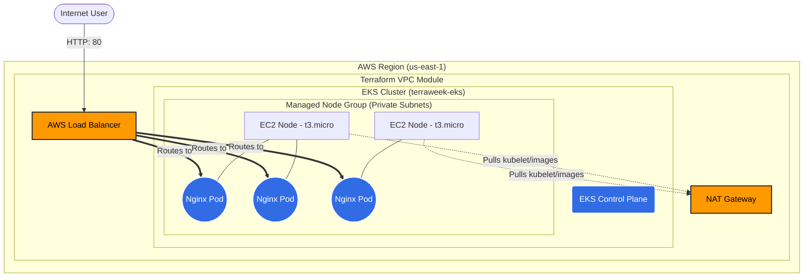

#  Day 66: Provisioning an EKS Cluster with Terraform Modules 


This repository contains the Infrastructure as Code (IaC) and Kubernetes manifests for provisioning a production-grade Amazon Elastic Kubernetes Service (EKS) cluster.

Using Terraform AWS registry modules, this project automates the creation of the underlying VPC, private/public subnets, NAT gateways, EKS control plane, and a Managed Node Group. It concludes with the deployment of a load-balanced Nginx web server.

---

## 🏗️ Architecture Diagram

The following diagram illustrates the infrastructure provisioned by this code. The EKS nodes are placed in private subnets and use a NAT Gateway for outbound internet access, while incoming internet traffic is routed through an AWS Load Balancer directly to the Nginx Pods.



---

## 📁 Repository Structure

```text
Day-66/
├── providers.tf                # AWS and Kubernetes provider configuration
├── variables.tf                # Input variables definitions
├── terraform.tfvars            # Environment-specific variable values (e.g., t3.micro)
├── vpc.tf                      # AWS VPC module provisioning
├── eks.tf                      # AWS EKS module provisioning
├── outputs.tf                  # Captured cluster connection details
├── day-66-eks-terraform.md     # Step-by-step Troubleshooting Cheat Sheet
└── k8s/
    └── nginx-deployment.yaml   # Complete Kubernetes Deployment & LoadBalancer Service

```

---

## 🚀 Quick Start Guide

### 1. Provision Infrastructure

Initialize Terraform and apply the configuration to create the VPC and EKS cluster.

```bash
terraform init
terraform apply -auto-approve

```

### 2. Configure Local Kubectl

Update your local kubeconfig to authenticate with the new cluster.

```bash
aws eks update-kubeconfig --name terraweek-eks --region us-east-1

```

### 3. Deploy Workload

Deploy the Nginx application and the LoadBalancer service.

```bash
kubectl apply -f k8s/nginx-deployment.yaml
kubectl get nodes

```

### 4. Access the Application

Watch the service to retrieve the AWS-provisioned Load Balancer URL.

```bash
kubectl get svc nginx-service -w

```

*(Copy the `EXTERNAL-IP` to your browser once it provisions).*

### 5. Cleanup

Always destroy the infrastructure when finished to avoid hourly billing for the EKS control plane and NAT Gateways.

```bash
terraform destroy -auto-approve

```
---
