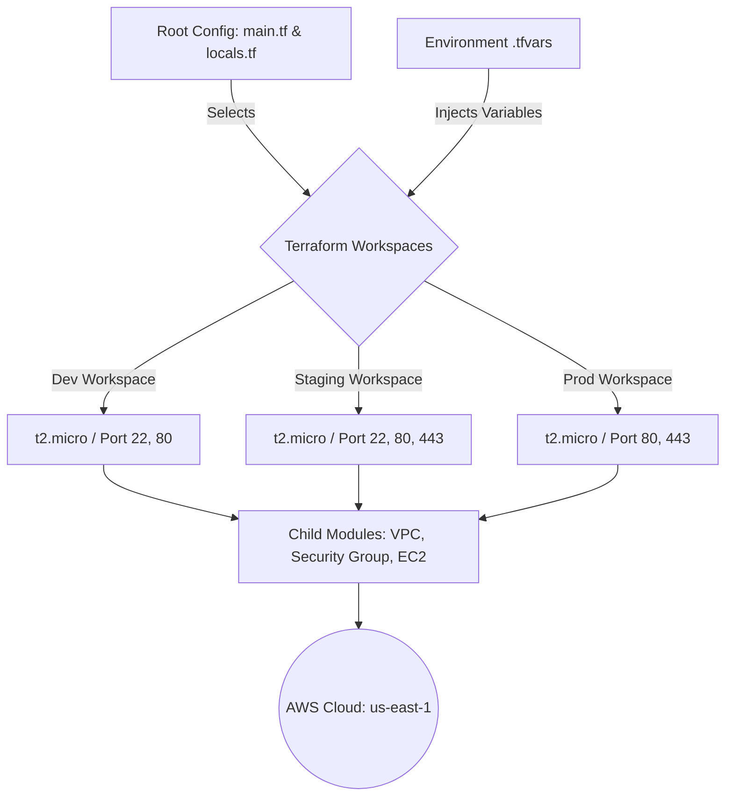

# 🚀 TerraWeek Capstone: Multi-Environment AWS Infrastructure

A production-ready Infrastructure as Code (IaC) project that dynamically provisions completely isolated AWS environments (Dev, Staging, Production) from a single, unified Terraform codebase. 

This project demonstrates advanced Terraform concepts including **Workspaces**, **Custom Child Modules**, **State Management**, and **Environment-Specific Variable Injection**, serving as a comprehensive showcase of modern DevOps and SRE practices.

---

## 🏗️ Architecture & Module Flow

This project utilizes a "Head Chef and Kitchen Stations" mental model. The root configuration acts as the orchestrator, reading environment-specific `.tfvars` files and delegating the actual resource creation to specialized custom modules.



---

## ✨ Key Features

* **DRY Codebase:** Eliminates code duplication by utilizing a single root `main.tf` for all environments.
* **Terraform Workspaces:** Leverages `terraform.workspace` to maintain strictly isolated state files for parallel environments.
* **Custom Reusable Modules:** Includes modularized configurations for Networking (VPC, IGW, Subnets), Security (Dynamic Security Groups), and Compute (EC2).
* **Dynamic Variable Injection:** Uses dedicated `.tfvars` files to ensure non-overlapping CIDR blocks and environment-specific security rules (e.g., SSH disabled in Production).
* **Root Outputs:** Aggregates and displays vital infrastructure endpoints (VPC IDs, Public IPs) directly to the CLI upon successful deployment.

---

## 📁 Repository Structure

```text
.
├── main.tf                 # Root orchestrator 
├── variables.tf            # Root variables declaration
├── locals.tf               # Local values (workspace tagging)
├── providers.tf            # AWS Provider config (v6.0)
├── outputs.tf              # Root outputs (IPs and IDs)
├── dev.tfvars              # Dev environment inputs
├── staging.tfvars          # Staging environment inputs
├── prod.tfvars             # Prod environment inputs
└── modules/
    ├── vpc/                # Networking module
    ├── security-group/     # Firewall module
    └── ec2-instance/       # Compute module

```

---

## 🚀 Getting Started

### Prerequisites

* [Terraform](https://developer.hashicorp.com/terraform/downloads?utm_source=gemini) (v1.5.0 or higher)
* [AWS CLI](https://aws.amazon.com/cli/?utm_source=gemini) configured with appropriate IAM credentials
* An active AWS Account (Free Tier eligible instances are used by default)

### 1. Clone the Repository

```bash
git clone [https://github.com/NB11-ML/Production-Ready-DevOps-SRE-Journey.git](https://github.com/NB11-ML/Production-Ready-DevOps-SRE-Journey.git)
cd Production-Ready-DevOps-SRE-Journey/terraweek-capstone

```

### 2. Initialize Terraform

Downloads the required AWS provider and initializes the custom child modules.

```bash
terraform init

```

### 3. Create Workspaces

Create the isolated state environments.

```bash
terraform workspace new dev
terraform workspace new staging
terraform workspace new prod

```

---

## ⚙️ Deployment Instructions

Deploy each environment by selecting its workspace and passing the corresponding variables file.

**Deploying Development:**

```bash
terraform workspace select dev
terraform apply -var-file="dev.tfvars"

```

**Deploying Staging:**

```bash
terraform workspace select staging
terraform apply -var-file="staging.tfvars"

```

**Deploying Production:**

```bash
terraform workspace select prod
terraform apply -var-file="prod.tfvars"

```

*(Note: Review the `terraform plan` output generated by the `apply` command before typing `yes` to confirm the infrastructure creation).*

### Retrieve Outputs

To quickly grab the Public IPs of all running environments:

```bash
for env in dev staging prod; do 
  echo -e "\n=== Outputs for $env ==="
  terraform workspace select $env
  terraform output
done
terraform workspace select default

```

---

## 🧹 Cleanup

To avoid incurring AWS charges, destroy the infrastructure when you are done testing. Always destroy in reverse order of deployment.

```bash
terraform workspace select prod
terraform destroy -var-file="prod.tfvars" -auto-approve

terraform workspace select staging
terraform destroy -var-file="staging.tfvars" -auto-approve

terraform workspace select dev
terraform destroy -var-file="dev.tfvars" -auto-approve

```

---
