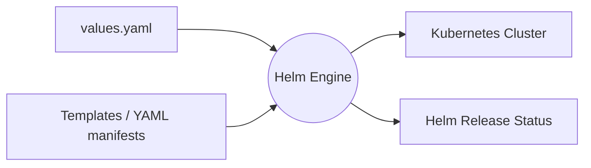

# Day 79: Building Custom Helm Charts for AI-BankApp

## 🎯 Objective
Migrate static Kubernetes manifests into a dynamic, reusable Helm chart. This transforms hardcoded deployments into flexible, environment-agnostic packages manageable via a single `values.yaml` file.

## 🧠 Core Concepts

### 1. The Helm Architecture
Helm acts as a templating engine bridging your configuration values and the Kubernetes API.



### 2. Chart Anatomy

* **`Chart.yaml`**: The metadata hub containing the chart name, version, and description.
* **`values.yaml`**: The central configuration file. This is the primary file modified to customize the deployment for different environments (Dev, QA, Prod).
* **`templates/`**: Contains the Go-templated Kubernetes manifests. Helm injects variables from `values.yaml` into these files using `{{ .Values.key }}` syntax during rendering.

### 3. Dynamic Secrets Management

Helm dynamically encodes secrets on the fly using the `b64enc` function:
`MYSQL_ROOT_PASSWORD: {{ .Values.secrets.mysqlRootPassword | b64enc | quote }}`

* **Production Reality:** While convenient for local development, committing plain-text passwords to `values.yaml` is an anti-pattern. In production, CI/CD pipelines inject variables dynamically (`--set`), or the cluster relies on External Secret Managers (AWS Secrets Manager, HashiCorp Vault) to keep Git repositories completely free of sensitive data.

## 🛠️ Execution Workflow

**1. Validation and Templating**
Verify template syntax and preview the exact YAML Helm will send to the Kubernetes API:

```bash
helm lint bankapp/
helm template my-bankapp bankapp/

```

**2. Deployment**
Deploy the chart, overriding default storage values for the local environment:

```bash
helm upgrade --install my-bankapp bankapp/ \
  --namespace bankapp --create-namespace \
  --set storageClass.create=false \
  --set mysql.persistence.storageClass=standard \
  --set ollama.persistence.storageClass=standard

```

## 🚨 SRE Troubleshooting Notes

* **Horizontal Pod Autoscaler (HPA) vs. Static Replicas:** If `autoscaling.enabled=true` is set in `values.yaml`, Helm deploys an HPA resource and ignores static `replicaCount` overrides passed via the CLI. To test static scaling, autoscaling must be explicitly disabled: `--set bankapp.autoscaling.enabled=false --set bankapp.replicaCount=2`.
* **ARM64 Architecture Mismatches (Apple Silicon):** Running local clusters on Mac M-series chips while pulling standard AMD64 images results in an `ErrImagePull` (`no match for platform in manifest`). The solution is to build the image locally (`docker build -t my-local-bankapp:latest .`), load it into the cluster (`kind load docker-image my-local-bankapp:latest --name tws-cluster`), and configure Helm to use the local image with `pullPolicy: IfNotPresent`.
* **Linting Failures on Default Templates:** The `helm create` command scaffolds a default `NOTES.txt` that attempts to read routing configurations (like `ingress`). If these are removed from a custom `values.yaml`, `helm lint` fails with a `nil pointer evaluating interface` error. The fix requires rewriting `NOTES.txt` to reflect the actual architecture.

---
